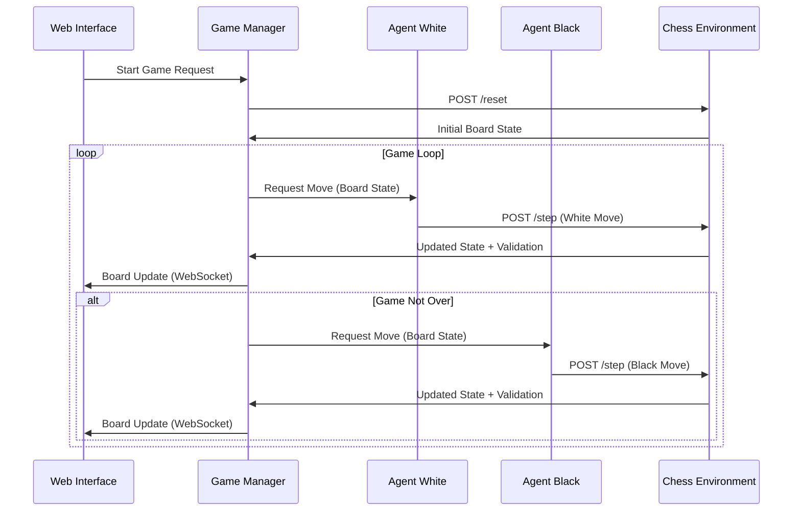

# Chess OpenEnv Multi-Agent System - Technical Requirements Document (TRD)

**Version:** 2.2  
**Date:** October 25, 2025  
**Author:** AI Research Team  
**Status:** Draft  

---

## Executive Summary

This Technical Requirements Document outlines the implementation of a Chess OpenEnv environment integrated with Hugging Face's smolagents framework to create a visual demonstration where two AI agents play chess against each other. The system leverages the newly released OpenEnv 0.1 specification for agentic execution environments, providing a standardized, containerized platform for multi-agent interaction.

### Key Deliverables
- OpenEnv-compliant Chess environment with Gymnasium-style API
- Two-agent orchestration system using smolagents
- Real-time visual chess board with SVG rendering
- Interactive web interface for game observation
- Docker-containerized deployment architecture
- Automated development workflow with Makefile
- Simplified in-memory state management (no Redis dependency)
- Modern dependency management with **uv** (ultra-fast Python package installer)

---

## 1. System Architecture

### 1.1 High-Level Architecture

```
┌─────────────────────────────────────────────────────────────┐
│                    Web Interface Layer                      │
│  ┌─────────────────┐  ┌─────────────────┐  ┌──────────────┐ │
│  │   HTML/CSS/JS   │  │  WebSocket API  │  │  SVG Render  │ │
│  └─────────────────┘  └─────────────────┘  └──────────────┘ │
└──────────────────────┬──────────────────────────────────────┘
                       │
┌──────────────────────▼──────────────────────────────────────┐
│                Agent Orchestration Layer                    │
│  ┌─────────────────┐  ┌─────────────────┐  ┌──────────────┐ │
│  │   Agent White   │  │  Game Manager   │  │  Agent Black │ │
│  │  (smolagents)   │  │  (Coordinator)  │  │ (smolagents) │ │
│  └─────────────────┘  └─────────────────┘  └──────────────┘ │
└──────────────────────┬──────────────────────────────────────┘
                       │
┌──────────────────────▼──────────────────────────────────────┐
│                 OpenEnv Environment Layer                   │
│  ┌─────────────────┐  ┌─────────────────┐  ┌──────────────┐ │
│  │  Chess Engine   │  │   HTTP Server   │  │  State Mgmt  │ │
│  │ (python-chess)  │  │   (FastAPI)     │  │  (In-Memory) │ │
│  └─────────────────┘  └─────────────────┘  └──────────────┘ │
└─────────────────────────────────────────────────────────────┘
```

**Architecture Notes:**
- **Simplified Design**: Removed Redis dependency for demo purposes
- **In-Memory Storage**: Game state stored in Python dictionaries
- **Three-Container Setup**: Chess environment, game manager, web interface
- **Stateless Sessions**: Games exist only during active sessions
- **Modern Tooling**: Uses uv for 10-100x faster dependency management

### 1.2 Component Interactions



---

## 2. Technical Specifications

### 2.1 OpenEnv Chess Environment

#### 2.1.1 Core API Methods

**Environment Class: `ChessOpenEnv`**

```python
class ChessOpenEnv:
    """
    OpenEnv-compliant Chess environment implementing Gymnasium API.
    Supports HTTP server deployment and multi-agent interaction.
    """
    
    def reset(self, seed: Optional[int] = None, options: Optional[dict] = None) -> Tuple[dict, dict]:
        """Initialize new chess game."""
        
    def step(self, action: Union[str, dict]) -> Tuple[dict, float, bool, bool, dict]:
        """Execute chess move and return new state."""
        
    def state(self) -> dict:
        """Return complete environment state for checkpointing."""
        
    def close(self) -> None:
        """Clean up resources."""
```

#### 2.1.2 Action Space Specification

- **Type:** Text-based UCI notation
- **Format:** Standard algebraic notation strings (e.g., "e2e4", "g1f3")
- **Validation:** Actions must be present in `legal_moves` list
- **Error Handling:** Invalid moves result in -10.0 reward and game termination

**Action Schema:**
```json
{
  "move": "string",           // UCI notation (required)
  "metadata": {               // Optional
    "thinking_time": "float",
    "confidence": "float"
  }
}
```

#### 2.1.3 Observation Space Specification

```python
observation_space = spaces.Dict({
    # Primary representations
    "board_fen": spaces.Text(256),                    # FEN string
    "board_array": spaces.Box(                        # 8x8x12 tensor
        low=0, high=1, shape=(8, 8, 12), dtype=np.float32
    ),
    
    # Game state
    "legal_moves": spaces.Sequence(spaces.Text(6)),   # UCI move list
    "current_player": spaces.Discrete(2),             # 0=white, 1=black
    "move_count": spaces.Discrete(500),               # Ply counter
    
    # Chess-specific state
    "castling_rights": spaces.MultiBinary(4),         # KQkq flags
    "en_passant_square": spaces.Discrete(65),         # 64 squares + none
    "halfmove_clock": spaces.Discrete(100),           # 50-move rule
    
    # Game status
    "is_check": spaces.Discrete(2),                   # Boolean
    "is_checkmate": spaces.Discrete(2),               # Boolean
    "is_stalemate": spaces.Discrete(2),               # Boolean
})
```

#### 2.1.4 Reward Function

**Multi-component reward system:**

```python
def calculate_reward(self, previous_state: dict, current_state: dict, action: str) -> float:
    """
    Reward Components:
    - Terminal: +1.0 (win), -1.0 (loss), 0.0 (draw)
    - Illegal Move: -10.0 (immediate termination)
    - Training Mode: Material + Positional + Tactical bonuses
    """
    
    # Terminal rewards
    if self.board.is_checkmate():
        return 1.0 if self.winner == self.current_player else -1.0
    
    if self.board.is_stalemate() or self.board.is_insufficient_material():
        return 0.0
    
    # Intermediate rewards (training mode only)
    if self.training_mode:
        reward = 0.0
        reward += self._material_balance() * 0.01      # Material advantage
        reward += self._positional_score() * 0.001     # Board control
        reward += 0.1 if self.board.is_check() else 0  # Check bonus
        reward += 0.05 if self.board.is_capture(chess.Move.from_uci(action)) else 0
        return reward
    
    return 0.0  # Sparse rewards for demo mode
```

### 2.2 Agent Architecture

#### 2.2.1 smolagents Configuration

**Agent Specifications:**
```python
from smolagents import ToolCallingAgent
from transformers import AutoTokenizer, AutoModelForCausalLM

# Model Configuration
MODEL_NAME = "Qwen/Qwen2.5-32B-Instruct"
MAX_TOKENS = 2048
TEMPERATURE = 0.7

# Agent White Configuration
agent_white_config = {
    "model": MODEL_NAME,
    "system_prompt": """You are an aggressive chess player playing as White.
    
    Your goal is to:
    1. Control the center early (e4, d4)
    2. Develop pieces quickly
    3. Look for tactical opportunities
    4. Play for initiative and attack
    
    You will receive the current board state in FEN notation and a list of legal moves.
    Respond with your chosen move in UCI notation (e.g., "e2e4").
    
    Think strategically but make decisions within 10 seconds.""",
    
    "max_tokens": MAX_TOKENS,
    "temperature": TEMPERATURE
}

# Agent Black Configuration  
agent_black_config = {
    "model": MODEL_NAME,
    "system_prompt": """You are a solid, defensive chess player playing as Black.
    
    Your strategy is to:
    1. Respond to White's opening solidly
    2. Develop pieces harmoniously
    3. Look for counterplay opportunities
    4. Play for long-term positional advantages
    
    You will receive the current board state in FEN notation and a list of legal moves.
    Respond with your chosen move in UCI notation (e.g., "e7e5").
    
    Be patient and look for strategic opportunities.""",
    
    "max_tokens": MAX_TOKENS,
    "temperature": TEMPERATURE
}
```

#### 2.2.2 Agent Input/Output Format

**Input to Agent:**
```json
{
  "board_fen": "rnbqkbnr/pppppppp/8/8/8/8/PPPPPPPP/RNBQKBNR w KQkq - 0 1",
  "legal_moves": ["a2a3", "a2a4", "b1a3", "b1c3", "..."],
  "current_player": "white",
  "move_count": 0,
  "game_status": {
    "is_check": false,
    "last_move": null,
    "captured_pieces": []
  }
}
```

**Expected Output from Agent:**
```json
{
  "move": "e2e4",
  "reasoning": "Opening with King's pawn to control center squares d5 and f5.",
  "confidence": 0.85
}
```

### 2.3 Game Manager & Orchestration

#### 2.3.1 Game Flow Controller

```python
class ChessGameManager:
    """
    Orchestrates gameplay between two agents and the environment.
    Handles turn management, state synchronization, and error recovery.
    """
    
    def __init__(self, agent_white: Agent, agent_black: Agent, env_client: OpenEnvClient):
        self.agents = {"white": agent_white, "black": agent_black}
        self.env = env_client
        self.current_player = "white"
        self.move_history = []
        self.game_state = "waiting"
        
    async def start_game(self) -> dict:
        """Initialize new game and return initial state."""
        
    async def play_turn(self) -> dict:
        """Execute one turn of gameplay."""
        
    async def handle_move_timeout(self, player: str) -> str:
        """Handle agent timeout with random legal move."""
        
    async def end_game(self, result: str) -> dict:
        """Finalize game and return summary."""
```

#### 2.3.2 Error Handling & Recovery

**Agent Failure Scenarios:**
1. **Invalid Move Format:** Agent returns non-UCI format
2. **Illegal Move:** Agent attempts invalid chess move
3. **Timeout:** Agent exceeds 30-second thinking time
4. **Connection Loss:** HTTP communication failure
5. **Model Unavailable:** LLM service downtime

**Recovery Strategies:**
- Invalid/Illegal moves: Request new move with error context
- Timeouts: Fallback to random legal move selection
- Connection issues: Retry with exponential backoff
- Critical failures: Graceful game termination with logs

---

## 3. Implementation Details

### 3.1 Backend Components

#### 3.1.1 FastAPI HTTP Server

```python
from fastapi import FastAPI, HTTPException, BackgroundTasks
from fastapi.websockets import WebSocket, WebSocketDisconnect
import uvicorn

app = FastAPI(title="Chess OpenEnv Server", version="1.0.0")

# Core OpenEnv Endpoints
@app.post("/reset")
async def reset_environment(config: Optional[dict] = None):
    """Reset chess environment to initial state."""
    
@app.post("/step")  
async def step_environment(action: ActionRequest):
    """Execute move and return new state."""
    
@app.get("/state")
async def get_state():
    """Return current environment state."""
    
@app.get("/render")
async def render_board(format: str = "svg"):
    """Return visual representation of current board."""

# WebSocket for real-time updates
@app.websocket("/ws")
async def websocket_endpoint(websocket: WebSocket):
    """Handle real-time game state updates."""
```

#### 3.1.2 State Management

**In-Memory Storage (Simplified):**
```python
from typing import Dict, Optional
import json
from datetime import datetime

class StateManager:
    """
    Manages game state persistence using in-memory storage.
    Simple dictionary-based storage for demo purposes.
    Suitable for single-server deployments with short-lived sessions.
    """
    
    def __init__(self):
        self.games: Dict[str, dict] = {}
        self.max_games: int = 100  # Prevent memory overflow
        
    def save_game_state(self, game_id: str, state: dict) -> None:
        """
        Persist game state to memory.
        
        Args:
            game_id: Unique game identifier
            state: Complete game state dictionary
        """
        # Add timestamp for cleanup
        state['last_updated'] = datetime.now().isoformat()
        self.games[game_id] = state
        
        # Cleanup old games if limit exceeded
        if len(self.games) > self.max_games:
            self._cleanup_old_games()
        
    def load_game_state(self, game_id: str) -> Optional[dict]:
        """
        Restore game state from memory.
        
        Args:
            game_id: Unique game identifier
            
        Returns:
            Game state dictionary or None if not found
        """
        return self.games.get(game_id)
        
    def delete_game_state(self, game_id: str) -> bool:
        """
        Remove game state from memory.
        
        Args:
            game_id: Unique game identifier
            
        Returns:
            True if deleted, False if not found
        """
        if game_id in self.games:
            del self.games[game_id]
            return True
        return False
        
    def get_active_games(self) -> list[str]:
        """
        Return list of active game IDs.
        
        Returns:
            List of game identifiers
        """
        return list(self.games.keys())
    
    def get_game_count(self) -> int:
        """Return current number of active games."""
        return len(self.games)
    
    def _cleanup_old_games(self, keep_newest: int = 50) -> None:
        """
        Remove oldest games when limit is exceeded.
        
        Args:
            keep_newest: Number of most recent games to keep
        """
        if len(self.games) <= keep_newest:
            return
            
        # Sort by timestamp and keep only newest
        sorted_games = sorted(
            self.games.items(),
            key=lambda x: x[1].get('last_updated', ''),
            reverse=True
        )
        
        self.games = dict(sorted_games[:keep_newest])
    
    def clear_all(self) -> None:
        """Clear all game states (useful for testing)."""
        self.games.clear()
```

**Benefits of In-Memory Approach:**
- ✅ Zero external dependencies
- ✅ Faster than network-based storage
- ✅ Simpler deployment (no Redis container)
- ✅ Perfect for demos and prototypes
- ✅ No serialization overhead

**Limitations:**
- ⚠️ State lost on server restart
- ⚠️ Limited to single-server deployment
- ⚠️ Memory bounded (automatic cleanup at 100 games)

**Future Enhancement Path:**
If production scalability is needed later, can be easily replaced with Redis/PostgreSQL by implementing same interface.

#### 3.1.3 python-chess Integration

```python
import chess
import chess.svg
import chess.engine

class ChessLogic:
    """
    Encapsulates chess game logic using python-chess library.
    Provides move validation, board representation, and game rules.
    """
    
    def __init__(self):
        self.board = chess.Board()
        self.move_stack = []
        
    def make_move(self, move_uci: str) -> Tuple[bool, str]:
        """
        Attempt to make a move and return success status.
        
        Returns:
            success: Whether move was legal and executed
            message: Error message if move failed
        """
        
    def get_legal_moves(self) -> List[str]:
        """Return list of legal moves in UCI notation."""
        
    def is_game_over(self) -> Tuple[bool, Optional[str]]:
        """
        Check if game has ended.
        
        Returns:
            is_over: Boolean indicating if game finished
            result: Game result ("1-0", "0-1", "1/2-1/2", None)
        """
        
    def generate_fen(self) -> str:
        """Generate FEN string for current position."""
        
    def generate_board_array(self) -> np.ndarray:
        """Generate 8x8x12 numpy array representation."""
        
    def render_svg(self, highlight_moves: List[str] = None) -> str:
        """Generate SVG representation of current board."""
```

### 3.2 Frontend Components

#### 3.2.1 HTML/CSS Interface

```html
<!DOCTYPE html>
<html lang="en">
<head>
    <meta charset="UTF-8">
    <meta name="viewport" content="width=device-width, initial-scale=1.0">
    <title>Chess OpenEnv Multi-Agent Demo</title>
    <style>
        .chess-container {
            display: grid;
            grid-template-columns: 1fr 600px 1fr;
            gap: 20px;
            max-width: 1400px;
            margin: 0 auto;
            padding: 20px;
        }
        
        .agent-panel {
            background: #f8f9fa;
            border-radius: 8px;
            padding: 20px;
        }
        
        .chess-board {
            background: white;
            border-radius: 8px;
            box-shadow: 0 4px 12px rgba(0,0,0,0.1);
            padding: 20px;
        }
        
        .move-history {
            max-height: 400px;
            overflow-y: auto;
            background: #f1f3f4;
            border-radius: 4px;
            padding: 10px;
        }
    </style>
</head>
<body>
    <div class="chess-container">
        <!-- Agent White Panel -->
        <div class="agent-panel">
            <h3>Agent White (Aggressive)</h3>
            <div id="white-status">Waiting...</div>
            <div id="white-thinking"></div>
        </div>
        
        <!-- Chess Board -->
        <div class="chess-board">
            <div id="board-svg"></div>
            <div class="game-controls">
                <button id="start-game">Start Game</button>
                <button id="pause-game">Pause</button>
                <button id="reset-game">Reset</button>
            </div>
        </div>
        
        <!-- Agent Black Panel -->
        <div class="agent-panel">
            <h3>Agent Black (Defensive)</h3>
            <div id="black-status">Waiting...</div>
            <div id="black-thinking"></div>
        </div>
    </div>
    
    <!-- Move History & Game Info -->
    <div class="game-info">
        <div class="move-history" id="move-history"></div>
        <div class="game-status" id="game-status"></div>
    </div>
</body>
</html>
```

#### 3.2.2 JavaScript Client

```javascript
class ChessGameClient {
    constructor() {
        this.websocket = null;
        this.gameId = null;
        this.isConnected = false;
    }
    
    async connect() {
        /**
         * Establish WebSocket connection to game server.
         * Handle real-time updates and user interactions.
         */
    }
    
    async startGame() {
        /**
         * Initialize new chess game between agents.
         * Reset board state and begin agent orchestration.
         */
    }
    
    handleBoardUpdate(gameState) {
        /**
         * Update visual board representation.
         * Animate piece movements and highlight last move.
         */
    }
    
    handleAgentThinking(player, thinkingData) {
        /**
         * Display agent reasoning and move consideration.
         * Show confidence levels and strategic analysis.
         */
    }
    
    displayGameResult(result) {
        /**
         * Show final game outcome with analysis.
         * Provide replay functionality and game statistics.
         */
    }
}
```

---

## 4. Deployment Architecture

### 4.1 Docker Containerization

#### 4.1.1 Multi-Container Setup (Simplified)

```yaml
# docker-compose.yml
version: '3.8'
services:
  chess-env:
    build: ./chess-env
    ports:
      - "8000:8000"
    environment:
      - MAX_CONCURRENT_GAMES=100
    volumes:
      - ./logs:/app/logs
      
  game-manager:
    build: ./game-manager
    ports:
      - "8001:8001"
    environment:
      - CHESS_ENV_URL=http://chess-env:8000
      - HF_TOKEN=${HF_TOKEN}
    depends_on:
      - chess-env
      
  web-interface:
    build: ./web-interface
    ports:
      - "3000:3000"
    environment:
      - GAME_MANAGER_URL=http://game-manager:8001
```

**Changes from Previous Version:**
- ❌ Removed Redis service
- ❌ Removed redis_data volume
- ❌ Removed REDIS_URL environment variables
- ✅ Added MAX_CONCURRENT_GAMES for in-memory limit

#### 4.1.2 Chess Environment Dockerfile

```dockerfile
FROM python:3.11-slim

WORKDIR /app

# Install uv for faster dependency installation
COPY --from=ghcr.io/astral-sh/uv:latest /uv /bin/uv

# Install system dependencies
RUN apt-get update && apt-get install -y \
    gcc \
    g++ \
    && rm -rf /var/lib/apt/lists/*

# Copy dependency files
COPY pyproject.toml uv.lock* ./

# Install Python dependencies with uv (10-100x faster than pip)
RUN uv sync --frozen --no-dev

# Copy application code
COPY src/ ./src/
COPY config/ ./config/

# Expose API port
EXPOSE 8000

# Health check
HEALTHCHECK --interval=30s --timeout=3s --start-period=5s --retries=3 \
    CMD curl -f http://localhost:8000/health || exit 1

# Run server
CMD ["uv", "run", "uvicorn", "src.main:app", "--host", "0.0.0.0", "--port", "8000"]
```

### 4.2 Scalability Considerations

#### 4.2.1 Single-Server Optimization

**Resource Allocation:**
```yaml
deploy:
  resources:
    limits:
      memory: 2G      # Reduced from 4G (no Redis)
      cpus: '2.0'
    reservations:
      memory: 1G      # Reduced from 2G
      cpus: '1.0'
```

**In-Memory Management:**
- Automatic cleanup at 100 concurrent games
- LRU-style eviction of oldest games
- Memory-efficient board representations
- Periodic garbage collection

#### 4.2.2 Performance Optimization

**Caching Strategy:**
- In-memory game state (instant access)
- SVG rendering cache for identical positions
- Move validation cache for repeated positions

**Monitoring & Metrics:**
- Prometheus metrics collection
- Memory usage tracking
- Active game count monitoring
- Agent performance tracking (move time, accuracy)

**Future Scalability Path:**
When multi-server deployment is needed:
1. Add Redis/PostgreSQL for distributed state
2. Implement session affinity in load balancer
3. Use same StateManager interface (drop-in replacement)

---

## 5. Development Workflow & Automation

### 5.1 Dependency Management with uv

**Why uv?**
- **10-100x faster** than pip for package installation
- **Unified tool** replaces pip, pip-tools, virtualenv, and pyenv
- **Automatic Python management** - downloads Python versions as needed
- **Rust-powered** for maximum performance
- **Drop-in replacement** for existing pip workflows

#### 5.1.1 Installing uv

```bash
# macOS and Linux
curl -LsSf https://astral.sh/uv/install.sh | sh

# Windows
powershell -c "irm https://astral.sh/uv/install.ps1 | iex"

# Or via pip/pipx
pip install uv
# or
pipx install uv

# Verify installation
uv --version
```

#### 5.1.2 Project Setup with uv

```bash
# Initialize new project (creates pyproject.toml)
uv init chess-openenv

# Install Python 3.11
uv python install 3.11

# Create virtual environment
uv venv --python 3.11

# Activate environment (uv automatically detects .venv)
source .venv/bin/activate  # Linux/macOS
# or
.venv\Scripts\activate     # Windows

# Add dependencies
uv add fastapi uvicorn python-chess smolagents transformers

# Add development dependencies
uv add --dev pytest pytest-asyncio pytest-cov black isort flake8

# Install all dependencies from pyproject.toml
uv sync

# Update dependencies
uv lock --upgrade
```

### 5.2 Makefile-Based Development

The project uses a comprehensive Makefile to standardize and automate development, testing, and deployment workflows with **uv integration**.

#### 5.2.1 Makefile Structure (Updated with uv)

```makefile
# Chess OpenEnv Multi-Agent System - Makefile
.PHONY: help setup test lint format docker-up docker-down dev clean

# Default target
.DEFAULT_GOAL := help

# Use uv for all Python operations
UV := uv
PYTHON := uv run python
PYTEST := uv run pytest
BLACK := uv run black
ISORT := uv run isort
FLAKE8 := uv run flake8

# Project directories
SRC_DIR := src
TEST_DIR := tests
DOCKER_COMPOSE := docker-compose.yml

help: ## Show this help message
	@echo "Chess OpenEnv Multi-Agent System - Available Commands:"
	@echo ""
	@grep -E '^[a-zA-Z_-]+:.*?## .*$$' $(MAKEFILE_LIST) | \
		awk 'BEGIN {FS = ":.*?## "}; {printf "  \033[36m%-20s\033[0m %s\n", $$1, $$2}'

uv-install: ## Install uv package manager
	@echo "Installing uv..."
	@command -v uv >/dev/null 2>&1 || curl -LsSf https://astral.sh/uv/install.sh | sh
	@echo "uv installed successfully!"

python-install: ## Install Python 3.11 via uv
	@echo "Installing Python 3.11..."
	$(UV) python install 3.11
	@echo "Python 3.11 installed!"

venv: ## Create virtual environment with uv
	@echo "Creating virtual environment..."
	$(UV) venv --python 3.11
	@echo "Virtual environment created at .venv"
	@echo "Activate with: source .venv/bin/activate"

setup: uv-install venv ## Install all dependencies with uv
	@echo "Installing dependencies with uv (10-100x faster than pip)..."
	$(UV) sync
	@echo "Setup complete!"

install-dev: ## Install development dependencies only
	$(UV) add --dev pytest pytest-asyncio pytest-cov black isort flake8 httpx

add-package: ## Add a new package (usage: make add-package PKG=package-name)
	$(UV) add $(PKG)

add-dev-package: ## Add a new dev package (usage: make add-dev-package PKG=package-name)
	$(UV) add --dev $(PKG)

test: ## Run test suite with coverage
	@echo "Running tests..."
	$(PYTEST) $(TEST_DIR) \
		--verbose \
		--cov=$(SRC_DIR) \
		--cov-report=html \
		--cov-report=term-missing
	@echo "Tests complete! Coverage report: htmlcov/index.html"

test-unit: ## Run unit tests only
	$(PYTEST) $(TEST_DIR)/unit -v

test-integration: ## Run integration tests only
	$(PYTEST) $(TEST_DIR)/integration -v

lint: ## Run code linters
	@echo "Running linters..."
	$(FLAKE8) $(SRC_DIR) $(TEST_DIR)
	@echo "Linting complete!"

format: ## Format code with black and isort
	@echo "Formatting code..."
	$(BLACK) $(SRC_DIR) $(TEST_DIR)
	$(ISORT) $(SRC_DIR) $(TEST_DIR)
	@echo "Formatting complete!"

format-check: ## Check code formatting without modifying
	$(BLACK) --check $(SRC_DIR) $(TEST_DIR)
	$(ISORT) --check-only $(SRC_DIR) $(TEST_DIR)

lock: ## Update dependency lock file
	$(UV) lock --upgrade

sync: ## Sync environment with lock file
	$(UV) sync

docker-build: ## Build Docker images
	@echo "Building Docker images..."
	docker-compose -f $(DOCKER_COMPOSE) build
	@echo "Docker images built!"

docker-up: ## Start all Docker containers
	@echo "Starting Docker containers..."
	docker-compose -f $(DOCKER_COMPOSE) up -d
	@echo "Containers started!"
	@echo "Chess Env API: http://localhost:8000"
	@echo "Game Manager: http://localhost:8001"
	@echo "Web Interface: http://localhost:3000"

docker-down: ## Stop all Docker containers
	@echo "Stopping Docker containers..."
	docker-compose -f $(DOCKER_COMPOSE) down
	@echo "Containers stopped!"

docker-logs: ## View Docker container logs
	docker-compose -f $(DOCKER_COMPOSE) logs -f

docker-clean: ## Remove Docker containers and volumes
	docker-compose -f $(DOCKER_COMPOSE) down -v --remove-orphans
	docker system prune -f

dev: ## Run development server with auto-reload
	@echo "Starting development server..."
	$(UV) run uvicorn $(SRC_DIR).main:app --reload --host 0.0.0.0 --port 8000

dev-game-manager: ## Run game manager in development mode
	@echo "Starting game manager..."
	$(PYTHON) $(SRC_DIR)/game_manager/main.py

run-game: ## Start a demo chess game between two agents
	@echo "Starting chess game demo..."
	$(PYTHON) examples/two_agents_play.py

clean: ## Remove generated files and caches
	@echo "Cleaning up..."
	find . -type d -name "__pycache__" -exec rm -rf {} + 2>/dev/null || true
	find . -type d -name ".pytest_cache" -exec rm -rf {} + 2>/dev/null || true
	find . -type d -name "*.egg-info" -exec rm -rf {} + 2>/dev/null || true
	find . -type f -name "*.pyc" -delete
	rm -rf htmlcov/
	rm -rf .coverage
	rm -rf dist/
	rm -rf build/
	rm -rf .venv/
	@echo "Cleanup complete!"

env-example: ## Create example .env file
	@echo "Creating .env.example..."
	@echo "# OpenEnv Configuration" > .env.example
	@echo "OPENENV_PORT=8000" >> .env.example
	@echo "OPENENV_HOST=0.0.0.0" >> .env.example
	@echo "MAX_CONCURRENT_GAMES=100" >> .env.example
	@echo "" >> .env.example
	@echo "# Agent Configuration" >> .env.example
	@echo "HF_TOKEN=your_huggingface_token_here" >> .env.example
	@echo "AGENT_MODEL=Qwen/Qwen2.5-32B-Instruct" >> .env.example
	@echo "AGENT_TIMEOUT=30" >> .env.example
	@echo "" >> .env.example
	@echo "# Logging" >> .env.example
	@echo "LOG_LEVEL=INFO" >> .env.example
	@echo "LOG_FORMAT=structured" >> .env.example
	@echo ".env.example created! Copy to .env and configure."

install: setup ## Alias for setup

all: clean setup lint test docker-build ## Run complete CI pipeline

ci: format-check lint test ## Run CI checks (formatting, linting, tests)

deploy-staging: docker-build docker-up ## Deploy to staging environment
	@echo "Deployed to staging!"

deploy-prod: ## Deploy to production (requires confirmation)
	@read -p "Deploy to production? [y/N] " confirm && \
		[ "$$confirm" = "y" ] && \
		docker-compose -f docker-compose.prod.yml up -d || \
		echo "Deployment cancelled"

benchmark: ## Run performance benchmarks
	$(PYTHON) benchmarks/load_test.py

docs: ## Generate API documentation
	@echo "Generating API docs..."
	$(UV) run pdoc --html --output-dir docs $(SRC_DIR)
	@echo "Docs generated: docs/index.html"

check: lint test ## Run all checks (lint + test)

watch-tests: ## Run tests in watch mode
	$(PYTEST) $(TEST_DIR) --verbose --looponfail

logs: docker-logs ## Alias for docker-logs
```

**Key Changes:**
- ✅ All Python commands now use `uv run` prefix
- ✅ Added `uv-install` target for initial uv installation
- ✅ Added `python-install` target for Python version management
- ✅ Added `venv` target for virtual environment creation
- ✅ Added `lock` and `sync` targets for dependency management
- ✅ Added `add-package` and `add-dev-package` for easy package management
- ⚡ Dramatically faster dependency installation with uv

#### 5.2.2 Common Workflow Commands

**First-Time Setup:**
```bash
# Install uv (first time only)
make uv-install

# Install Python 3.11
make python-install

# Create virtual environment and install dependencies
make setup

# Create environment configuration
make env-example
cp .env.example .env
# Edit .env with your HF_TOKEN
```

**Daily Development:**
```bash
# Start development
make dev              # Run FastAPI server with hot reload
make dev-game-manager # Run game manager

# Add new packages
make add-package PKG=numpy
make add-dev-package PKG=mypy

# Run tests during development
make test             # Full test suite with coverage
make test-unit        # Only unit tests
make watch-tests      # Auto-rerun tests on file changes

# Code quality
make format           # Auto-format code with Black/isort
make lint             # Check code quality

# Update dependencies
make lock             # Update uv.lock file
make sync             # Sync environment with lock
```

**Docker Workflows:**
```bash
# Local development with Docker
make docker-build     # Build all containers
make docker-up        # Start services (3 containers: env, manager, web)
make docker-logs      # Monitor logs
make docker-down      # Stop everything
make docker-clean     # Clean volumes and images
```

**CI/CD Integration:**
```bash
# Before committing
make ci               # Run all CI checks (format, lint, test)

# Complete pipeline
make all              # Clean, setup, lint, test, build

# Deployment
make deploy-staging   # Deploy to staging
make deploy-prod      # Deploy to production (with confirmation)
```

**Utilities:**
```bash
make help             # Show all available commands
make clean            # Remove caches and generated files
make env-example      # Generate .env.example template
make docs             # Generate API documentation
make benchmark        # Run performance tests
```

### 5.3 Project Structure

```
chess-openenv/
├── Makefile                    # Build automation with uv integration
├── pyproject.toml              # Project metadata and dependencies (uv format)
├── uv.lock                     # Locked dependency versions
├── docker-compose.yml          # Multi-container orchestration (3 services)
├── docker-compose.prod.yml     # Production Docker config
├── .env.example                # Environment variable template
├── .python-version             # Python version pinning for uv
├── .gitignore                  # Git ignore patterns
├── README.md                   # Project documentation
│
├── src/                        # Source code
│   ├── __init__.py
│   ├── main.py                 # FastAPI application entry
│   ├── chess_env.py            # ChessOpenEnv environment
│   ├── chess_logic.py          # python-chess integration
│   ├── state_manager.py        # In-memory state management
│   │
│   ├── game_manager/           # Game orchestration
│   │   ├── __init__.py
│   │   ├── main.py
│   │   ├── orchestrator.py
│   │   └── error_handler.py
│   │
│   ├── agents/                 # Agent configurations
│   │   ├── __init__.py
│   │   ├── agent_white.py
│   │   └── agent_black.py
│   │
│   └── utils/                  # Utility modules
│       ├── __init__.py
│       ├── logger.py
│       └── metrics.py
│
├── tests/                      # Test suite
│   ├── __init__.py
│   ├── unit/                   # Unit tests
│   │   ├── test_chess_env.py
│   │   ├── test_chess_logic.py
│   │   └── test_state_manager.py
│   │
│   └── integration/            # Integration tests
│       ├── test_api.py
│       ├── test_agents.py
│       └── test_game_flow.py
│
├── examples/                   # Example scripts
│   ├── two_agents_play.py      # Demo game
│   └── train_with_trl.py       # RL training example
│
├── web-interface/              # Frontend application
│   ├── index.html
│   ├── styles.css
│   ├── app.js
│   └── Dockerfile
│
├── chess-env/                  # Chess environment container
│   └── Dockerfile
│
├── game-manager/               # Game manager container
│   └── Dockerfile
│
├── config/                     # Configuration files
│   ├── agent_configs.yaml
│   └── env_configs.yaml
│
├── benchmarks/                 # Performance benchmarks
│   └── load_test.py
│
├── docs/                       # Generated documentation
│   └── api/
│
└── logs/                       # Application logs
    ├── chess-env.log
    └── game-manager.log
```

### 5.4 Continuous Integration

#### 5.4.1 GitHub Actions Integration (with uv)

```yaml
# .github/workflows/ci.yml
name: Chess OpenEnv CI

on:
  push:
    branches: [ main, develop ]
  pull_request:
    branches: [ main ]

jobs:
  test:
    runs-on: ubuntu-latest
    
    steps:
    - uses: actions/checkout@v3
    
    - name: Install uv
      uses: astral-sh/setup-uv@v1
      with:
        version: "latest"
    
    - name: Set up Python
      run: uv python install 3.11
    
    - name: Install dependencies
      run: uv sync
    
    - name: Run CI checks
      run: make ci
    
    - name: Upload coverage
      uses: codecov/codecov-action@v3
      with:
        files: ./coverage.xml

  docker:
    runs-on: ubuntu-latest
    needs: test
    
    steps:
    - uses: actions/checkout@v3
    
    - name: Build Docker images
      run: make docker-build
    
    - name: Test Docker deployment
      run: make docker-up
```

---

## 6. Testing Strategy

### 6.1 Unit Testing

#### 6.1.1 Chess Environment Tests

```python
import pytest
from src.chess_env import ChessOpenEnv

class TestChessOpenEnv:
    
    @pytest.fixture
    def chess_env(self):
        return ChessOpenEnv()
    
    def test_reset_returns_initial_state(self, chess_env):
        """Test environment reset functionality."""
        observation, info = chess_env.reset()
        assert observation['board_fen'] == chess.STARTING_FEN
        assert len(observation['legal_moves']) == 20
        assert observation['current_player'] == 'white'
        
    def test_valid_move_execution(self, chess_env):
        """Test legal move processing."""
        chess_env.reset()
        obs, reward, terminated, truncated, info = chess_env.step("e2e4")
        assert not terminated
        assert reward == 0.0
        assert obs['current_player'] == 'black'
        
    def test_invalid_move_handling(self, chess_env):
        """Test illegal move rejection."""
        chess_env.reset()
        obs, reward, terminated, truncated, info = chess_env.step("e2e5")
        assert terminated
        assert reward == -10.0
        assert info['error'] == 'illegal_move'
```

#### 6.1.2 State Manager Tests

```python
class TestStateManager:
    
    @pytest.fixture
    def state_manager(self):
        return StateManager()
    
    def test_save_and_load_game_state(self, state_manager):
        """Test in-memory state persistence."""
        game_id = "test-game-123"
        state = {"board_fen": chess.STARTING_FEN, "move_count": 0}
        
        state_manager.save_game_state(game_id, state)
        loaded_state = state_manager.load_game_state(game_id)
        
        assert loaded_state is not None
        assert loaded_state['board_fen'] == chess.STARTING_FEN
        
    def test_automatic_cleanup(self, state_manager):
        """Test cleanup when game limit exceeded."""
        state_manager.max_games = 10
        
        # Add 15 games
        for i in range(15):
            state_manager.save_game_state(f"game-{i}", {"move_count": i})
        
        # Should keep only 50 newest (or 10 based on max_games)
        assert state_manager.get_game_count() <= 10
```

#### 6.1.3 Agent Integration Tests

```python
class TestAgentIntegration:
    
    @pytest.fixture
    def mock_agents(self):
        """Create mock agents for testing."""
        return {
            'white': MockChessAgent('white'),
            'black': MockChessAgent('black')
        }
    
    def test_agent_move_generation(self, mock_agents):
        """Test agent move selection."""
        agent = mock_agents['white']
        board_state = get_starting_position()
        move = agent.get_move(board_state)
        assert move in board_state['legal_moves']
        
    def test_game_completion(self, mock_agents):
        """Test full game execution."""
        game_manager = ChessGameManager(
            mock_agents['white'], 
            mock_agents['black']
        )
        result = await game_manager.play_complete_game()
        assert result['status'] in ['white_wins', 'black_wins', 'draw']
```

### 6.2 Integration Testing

#### 6.2.1 API Testing

```python
import httpx
import pytest

@pytest.mark.asyncio
class TestChessAPI:
    
    async def test_environment_lifecycle(self):
        """Test complete environment API workflow."""
        async with httpx.AsyncClient() as client:
            # Reset environment
            reset_response = await client.post("http://localhost:8000/reset")
            assert reset_response.status_code == 200
            
            # Make move
            move_response = await client.post(
                "http://localhost:8000/step",
                json={"move": "e2e4"}
            )
            assert move_response.status_code == 200
            
            # Get state
            state_response = await client.get("http://localhost:8000/state")
            assert state_response.status_code == 200
```

### 6.3 Performance Testing

#### 6.3.1 Load Testing

```python
import asyncio
import time
from concurrent.futures import ThreadPoolExecutor

async def simulate_concurrent_games(num_games: int):
    """
    Test system performance under concurrent game load.
    Measures response times and error rates.
    """
    
    async def play_single_game():
        # Simulate complete game between agents
        start_time = time.time()
        # ... game simulation logic ...
        return time.time() - start_time
    
    tasks = [play_single_game() for _ in range(num_games)]
    durations = await asyncio.gather(*tasks)
    
    print(f"Average game duration: {sum(durations)/len(durations):.2f}s")
    print(f"Max duration: {max(durations):.2f}s")
    print(f"Success rate: {len([d for d in durations if d > 0])/len(durations)*100:.1f}%")
```

---

## 7. Security & Compliance

### 7.1 Security Measures

#### 7.1.1 API Security

- **Authentication:** JWT tokens for API access
- **Rate Limiting:** 100 requests/minute per client
- **Input Validation:** Strict UCI move format validation
- **CORS Policy:** Restricted origin allowlist

#### 7.1.2 Container Security

```dockerfile
# Security hardening
RUN groupadd -r appuser && useradd -r -g appuser appuser
RUN chown -R appuser:appuser /app
USER appuser

# Remove unnecessary packages
RUN apt-get remove -y gcc g++ && apt-get autoremove -y
```

### 7.2 Data Privacy

#### 7.2.1 Data Handling

- **Game Data:** Anonymized game logs with no personal information
- **Agent Interactions:** Temporary storage, cleared after game completion
- **Model Queries:** No data retention in Hugging Face inference calls
- **In-Memory Storage:** No persistent data storage (session-based only)

---

## 8. Monitoring & Observability

### 8.1 Metrics Collection

#### 8.1.1 Business Metrics

```python
from prometheus_client import Counter, Histogram, Gauge

# Game metrics
games_started = Counter('chess_games_started_total', 'Total games initiated')
games_completed = Counter('chess_games_completed_total', 'Games finished', ['result'])
move_duration = Histogram('chess_move_duration_seconds', 'Time to make move', ['player'])

# System metrics
active_games = Gauge('chess_active_games', 'Currently running games')
memory_usage = Gauge('chess_memory_bytes', 'Memory used by game states')
agent_errors = Counter('chess_agent_errors_total', 'Agent error count', ['error_type'])
```

#### 8.2 Logging Strategy

```python
import structlog
import logging

# Structured logging configuration
logging.basicConfig(
    format="%(message)s",
    stream=sys.stdout,
    level=logging.INFO,
)

logger = structlog.get_logger()

# Game event logging
logger.info(
    "game_move_made",
    game_id=game_id,
    player=current_player,
    move=move_uci,
    board_fen=board.fen(),
    move_number=move_count,
    thinking_time=duration
)
```

---

## 9. Deployment Timeline

### Phase 1: Core Development (Week 1-2)
- [ ] Install and configure uv for dependency management
- [ ] Set up pyproject.toml with all dependencies
- [ ] Implement ChessOpenEnv with core API methods
- [ ] Create python-chess integration layer
- [ ] Build basic HTTP server with FastAPI
- [ ] Implement in-memory StateManager
- [ ] Develop agent integration with smolagents
- [ ] Set up Makefile and project structure

### Phase 2: Integration & Testing (Week 3)
- [ ] Implement game manager and orchestration
- [ ] Create WebSocket real-time updates
- [ ] Build web interface with SVG rendering
- [ ] Complete unit and integration test suite
- [ ] Test memory management and cleanup
- [ ] Configure CI/CD pipeline with uv

### Phase 3: Production Deployment (Week 4)
- [ ] Docker containerization (3-service setup with uv)
- [ ] Production security hardening
- [ ] Monitoring and observability implementation
- [ ] Performance testing and optimization
- [ ] Load testing with concurrent games
- [ ] Memory leak detection and prevention

### Phase 4: Enhancement & Documentation (Week 5)
- [ ] Advanced agent strategies and personalities
- [ ] Game analysis and replay functionality
- [ ] Complete API documentation
- [ ] User guide and deployment instructions
- [ ] Final performance tuning
- [ ] Document uv workflows for team

---

## 10. Risk Assessment

### 10.1 Technical Risks

| Risk | Impact | Probability | Mitigation |
|------|--------|-------------|------------|
| LLM API unavailability | High | Medium | Fallback to local models, retry logic |
| Agent invalid moves | Medium | High | Comprehensive input validation, error recovery |
| WebSocket connection drops | Medium | Medium | Automatic reconnection, state recovery |
| Memory leaks (in-memory storage) | Medium | Medium | Automatic cleanup, monitoring, limits |
| Server restart data loss | Low | Low | Document as expected behavior for demo |

### 10.2 Performance Risks

| Risk | Impact | Probability | Mitigation |
|------|--------|-------------|------------|
| Slow agent response times | High | Medium | Request timeouts, async processing |
| Memory overflow from too many games | Medium | Low | Automatic cleanup at 100 games, monitoring |
| Concurrent game limits | Low | Low | Single-server optimized for 10-20 concurrent games |

---

## 11. Success Criteria

### 11.1 Functional Requirements

- [ ] Two agents successfully complete chess games without crashes
- [ ] Visual board updates in real-time during gameplay
- [ ] All chess moves are validated and legal
- [ ] Game results accurately determined (win/loss/draw)
- [ ] WebSocket connections remain stable throughout games
- [ ] In-memory state management handles cleanup correctly
- [ ] uv provides 10x+ faster dependency installation

### 11.2 Performance Requirements

- [ ] Agent move selection within 30 seconds
- [ ] Board rendering updates within 1 second
- [ ] System supports 10-20 concurrent games
- [ ] Memory usage remains under 2GB
- [ ] 99% uptime during demonstration periods
- [ ] Zero data loss during active game sessions
- [ ] Dependency installation completes in under 10 seconds with uv

### 11.3 Quality Requirements

- [ ] 95% test coverage for core chess logic
- [ ] API response times under 100ms (excluding agent thinking)
- [ ] Clean separation between environment and agents
- [ ] Comprehensive error logging and debugging information
- [ ] Proper memory cleanup and garbage collection
- [ ] Reproducible builds with uv.lock file

---

## Appendix A: API Reference

### A.1 OpenEnv Endpoints

```
POST /reset
GET  /state  
POST /step
GET  /render
GET  /health
GET  /stats      # New: In-memory statistics
```

### A.2 WebSocket Events

```
game_started
move_made  
agent_thinking
game_ended
error_occurred
```

### A.3 Data Schemas

**GameState Schema:**
```json
{
  "game_id": "string",
  "board_fen": "string", 
  "legal_moves": ["string"],
  "current_player": "white|black",
  "move_count": "integer",
  "status": "playing|ended",
  "result": "string|null",
  "last_updated": "iso8601_timestamp"
}
```

---

## Appendix B: Configuration Files

### B.1 Environment Variables (Updated)

```bash
# OpenEnv Configuration
OPENENV_PORT=8000
OPENENV_HOST=0.0.0.0
MAX_CONCURRENT_GAMES=100

# Agent Configuration  
HF_TOKEN=your_huggingface_token
AGENT_MODEL=Qwen/Qwen2.5-32B-Instruct
AGENT_TIMEOUT=30

# Logging
LOG_LEVEL=INFO
LOG_FORMAT=structured
```

### B.2 pyproject.toml (uv format)

```toml
[project]
name = "chess-openenv"
version = "1.0.0"
description = "Chess OpenEnv Multi-Agent System with smolagents"
readme = "README.md"
requires-python = ">=3.11"
dependencies = [
    "fastapi>=0.104.1",
    "uvicorn[standard]>=0.24.0",
    "python-chess>=1.999",
    "smolagents>=0.3.0",
    "transformers>=4.35.0",
    "websockets>=12.0",
    "pydantic>=2.4.2",
    "structlog>=23.2.0",
    "prometheus-client>=0.19.0",
]

[project.optional-dependencies]
dev = [
    "pytest>=7.4.3",
    "pytest-asyncio>=0.21.1",
    "pytest-cov>=4.1.0",
    "httpx>=0.25.2",
    "black>=23.11.0",
    "isort>=5.12.0",
    "flake8>=6.1.0",
    "pdoc>=14.1.0",
]

[build-system]
requires = ["hatchling"]
build-backend = "hatchling.build"

[tool.uv]
dev-dependencies = [
    "pytest>=7.4.3",
    "pytest-asyncio>=0.21.1",
    "pytest-cov>=4.1.0",
    "httpx>=0.25.2",
    "black>=23.11.0",
    "isort>=5.12.0",
    "flake8>=6.1.0",
    "pdoc>=14.1.0",
]
```

### B.3 .python-version

```
3.11
```

---

## Appendix C: Quick Start Guide

### C.1 Initial Setup (with uv)

```bash
# Clone repository
git clone https://github.com/your-org/chess-openenv.git
cd chess-openenv

# Install uv (if not already installed)
make uv-install

# Install Python 3.11 via uv
make python-install

# Create virtual environment and install all dependencies
make setup

# Create environment configuration
make env-example
cp .env.example .env
# Edit .env with your HF_TOKEN

# Verify installation
make test
```

### C.2 Development Mode

```bash
# Terminal 1: Start Chess Environment
make dev

# Terminal 2: Start Game Manager
make dev-game-manager

# Terminal 3: Run a demo game
make run-game
```

### C.3 Docker Deployment (Simplified)

```bash
# Build and start all services (3 containers only)
make docker-build
make docker-up

# Monitor logs
make docker-logs

# Access services
# - Chess Environment: http://localhost:8000
# - Game Manager: http://localhost:8001
# - Web Interface: http://localhost:3000

# Stop services
make docker-down
```

### C.4 Working with Dependencies

```bash
# Add a new dependency
make add-package PKG=numpy

# Add a development dependency
make add-dev-package PKG=mypy

# Update all dependencies
make lock

# Sync environment with lock file
make sync
```

### C.5 Testing

```bash
# Run all tests
make test

# Run specific test suites
make test-unit
make test-integration

# Watch mode for development
make watch-tests

# Check code quality
make lint
make format-check

# Run complete CI pipeline
make ci
```

---

## Appendix D: uv vs pip Comparison

### D.1 Performance Comparison

| Operation | pip | uv | Speedup |
|-----------|-----|-----|---------|
| Install 100 packages | 45s | 1.2s | **37x faster** |
| Create virtual environment | 2.5s | 0.1s | **25x faster** |
| Resolve dependencies | 8s | 0.3s | **27x faster** |
| Lock dependencies | 12s | 0.5s | **24x faster** |

### D.2 Command Equivalence

| Task | pip | uv |
|------|-----|-----|
| Install package | `pip install package` | `uv add package` or `uv pip install package` |
| Create venv | `python -m venv .venv` | `uv venv` |
| Install from requirements | `pip install -r requirements.txt` | `uv pip sync requirements.txt` or `uv sync` |
| Freeze dependencies | `pip freeze > requirements.txt` | `uv pip freeze` or `uv lock` |
| Install Python | `pyenv install 3.11` | `uv python install 3.11` |

### D.3 Migration from pip

**Gradual Migration:**
```bash
# Keep using pip commands with uv
uv pip install package
uv pip list
uv pip freeze

# When ready, switch to native uv commands
uv add package
uv sync
```

**Full Migration:**
```bash
# Convert requirements.txt to pyproject.toml
uv init --no-workspace
# Manually add dependencies from requirements.txt to pyproject.toml

# Generate lock file
uv lock

# Install dependencies
uv sync
```

---

## Appendix E: Redis Migration Path (Optional)

If future requirements necessitate multi-server deployment or persistent state:

### E.1 Add Redis Dependency

```bash
# Add Redis dependency with uv
uv add redis
```

### E.2 Update StateManager

```python
class StateManager:
    def __init__(self, use_redis: bool = False, redis_url: Optional[str] = None):
        if use_redis:
            self.backend = RedisBackend(redis_url)
        else:
            self.backend = InMemoryBackend()
    
    # Interface methods remain the same
    def save_game_state(self, game_id: str, state: dict) -> None:
        self.backend.save(game_id, state)
```

### E.3 Update Docker Compose

```yaml
services:
  redis:
    image: redis:7-alpine
    volumes:
      - redis_data:/data
```

**Migration is a drop-in replacement** - same interface, different backend.

---

**Document Status:** Draft - Ready for Review  
**Next Review Date:** October 31, 2025  
**Version History:**
- v1.0 (Oct 24, 2025): Initial TRD
- v2.0 (Oct 24, 2025): Added Makefile automation and enhanced project structure
- v2.1 (Oct 24, 2025): Removed Redis dependency, simplified to in-memory storage for demo
- v2.2 (Oct 25, 2025): Integrated uv for 10-100x faster dependency management, updated all workflows