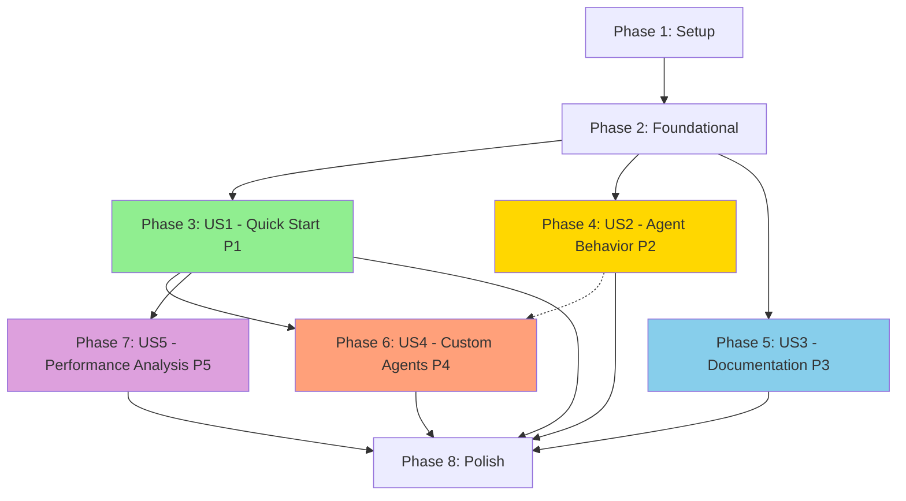

# Implementation Tasks: OpenEnv Multi-Agent Chess Demo

**Feature**: `001-openenv-chess-demo`  
**Generated**: 2025-10-25  
**Total User Stories**: 5 (P1-P5 from spec.md)  
**Estimated Timeline**: 4-5 weeks  
**MVP Scope**: User Story 1 only (P1 - Quick Start Demo)

---

## Task Summary

| Phase | User Story | Task Count | Parallelizable | Independently Testable |
|-------|-----------|------------|----------------|----------------------|
| Phase 1 | Setup | 12 | 6 | N/A |
| Phase 2 | Foundational | 21 | 8 | Yes (unit tests) |
| Phase 3 | US1: Quick Start Demo (P1) | 26 | 12 | Yes (5-minute test) |
| Phase 4 | US2: Agent Behavior (P2) | 18 | 10 | Yes (reasoning display) |
| Phase 5 | US3: Documentation (P3) | 14 | 8 | Yes (docs accessible) |
| Phase 6 | US4: Custom Agents (P4) | 17 | 9 | Yes (config reload) |
| Phase 6.5 | US4.5: Hub Integration (P4.5) | 8 | 4 | Yes (roundtrip test) |
| Phase 7 | US5: Performance Analysis (P5) | 13 | 7 | Yes (metrics export) |
| Phase 8 | Polish & Integration | 13 | 5 | Yes (full e2e) |
| **Total** | **9 phases** | **144** | **69** | **All stories** |

---

## Dependencies & Execution Order



**Legend**:
- **Solid arrows**: Hard dependencies (must complete before starting)
- **Dotted arrows**: Soft dependencies (helpful but not blocking)
- **Green (US1)**: MVP - can ship after this story
- **US2-US5**: Can be developed in parallel after US1

---

## MVP Strategy

**Minimum Viable Product (Week 2-3)**: Complete through Phase 3 (US1)

**Deliverable**: Working chess game where two agents play against each other with basic visual updates

**Success Criteria**:
- Deploy with single command (`make docker-up`)
- See game start within 5 minutes
- Watch agents make moves automatically
- Board updates in real-time
- Game completes successfully 95% of time

**Defer to Later**:
- Agent reasoning panels (US2)
- Documentation links (US3)
- Custom agent configuration (US4)
- Performance metrics export (US5)

---

## Phase 1: Setup & Project Initialization

**Goal**: Create project structure, install dependencies, configure tooling

**Duration**: Day 1  
**Dependencies**: None  
**Blocking**: All subsequent phases

### Tasks

- [X] T001 Install uv package manager following official guide at https://docs.astral.sh/uv/
- [X] T002 Create project structure: src/, tests/, web/, config/, docs/
- [X] T003 [P] Create .python-version file pinning to Python 3.11
- [X] T003.5 Study openenv/openspiel_env GitHub repository for game state representation patterns, reward function design for turn-based games, multi-player coordination patterns, terminal state detection. Document findings in docs/openspiel-patterns.md
- [X] T004 Pin Python version to 3.11 in .python-version file
- [X] T005 [P] Add core dependencies: openenv-core, fastapi, uvicorn, python-chess in pyproject.toml
- [X] T006 [P] Add agent dependencies: smolagents, transformers in pyproject.toml
- [X] T007 [P] Add utility dependencies: websockets, pydantic, structlog, prometheus-client in pyproject.toml
- [X] T008 [P] Add dev dependencies: pytest, pytest-asyncio, pytest-cov, black, isort, flake8, httpx in pyproject.toml
- [X] T009 Create virtual environment and install all dependencies: `uv sync`
- [X] T010 [P] Create Makefile with common commands (install, test, lint, docker-up, clean)
- [X] T011 [P] Create .gitignore for Python, Docker, IDE files
- [X] T012 Create .env.example with HUGGINGFACE_TOKEN, LOG_LEVEL, MAX_CONCURRENT_GAMES placeholders

**Setup Verification**:
```bash
uv run python --version  # Should show Python 3.11.x
uv run pytest --version  # Should show pytest 7.4.0+
make help               # Should list all available commands
```

---

## Phase 2: Foundational Components

**Goal**: Implement core chess logic, OpenEnv interface, state management (blocking for all user stories)

**Duration**: Days 2-4  
**Dependencies**: Phase 1 complete  
**Blocking**: All user story phases (US1-US5)

### Tasks

- [X] T013 [P] Create src/models/board_state.py with BoardState dataclass (FEN, tensor, legal_moves)
- [X] T014 [P] Create src/models/move.py with Move dataclass (UCI, SAN, piece, player, timestamp)
- [X] T014.5 Review error handling in openenv/echo and openenv/coding repositories: timeout behavior, retry logic, error message formatting, recovery strategies. Document comparison in docs/error-handling-patterns.md and validate 3-retry approach aligns with OpenEnv community patterns
- [X] T015 [P] Create src/models/game.py with Game dataclass (game_id, board_state, move_history, status)
- [X] T016 [P] Create src/models/agent.py with Agent and AgentStats dataclasses
- [X] T017 [P] Create src/models/session.py with GameSession dataclass (session_id, game_id, websockets)
- [X] T017.5 Create config/default_agent_config.yaml with documented default values for temperature (0.7), max_tokens (2048), timeout (30)
- [X] T018 Implement src/chess_logic.py wrapper around python-chess for move validation
- [X] T019 Implement src/chess_logic.py method: `is_legal_move(board, move_uci)` returning bool
- [X] T020 Implement src/chess_logic.py method: `apply_move(board, move_uci)` returning new BoardState
- [X] T021 Implement src/chess_logic.py method: `get_legal_moves(board)` returning List[str]
- [X] T022 Implement src/chess_logic.py method: `render_svg(board)` for board visualization
- [X] T023 Create src/chess_env.py implementing ChessOpenEnv class inheriting from openenv_core.env_server.Environment base class (requires T003.5 OpenSpiel patterns review)
- [X] T024 Implement ChessOpenEnv.reset() method returning initial observation and info per OpenEnv spec
- [X] T025 Implement ChessOpenEnv.step(action) method returning observation, reward, terminated, truncated, info per OpenEnv spec
- [X] T026 Implement ChessOpenEnv.state() method returning current game metadata per OpenEnv spec
- [X] T027 Implement ChessOpenEnv.close() method for cleanup per OpenEnv spec
- [X] T028 Create src/state_manager.py with in-memory StateManager class (Dict[str, Game])
- [X] T029 Implement StateManager CRUD methods: create_game(), get_game(), update_game(), cleanup_game()
- [X] T030 Implement StateManager LRU cleanup when max_concurrent_games (100) reached
- [ ] T030.5 [P] [FR-031] Implement HUGGINGFACE_TOKEN environment variable loading in src/agents/agent_manager.py
- [ ] T030.6 [FR-032] Add HUGGINGFACE_TOKEN setup instructions to README.md and docs/quickstart.md
- [ ] T030.7 [FR-033] Implement helpful error message display when HUGGINGFACE_TOKEN is missing or invalid
- [X] T031 [P] Create tests/test_chess_logic.py with unit tests for all chess_logic methods
- [X] T032 [P] Create tests/test_chess_env.py with unit tests for OpenEnv interface methods (verify compliance with openenv-core base class)
- [X] T033 [P] Create tests/test_state_manager.py with unit tests for CRUD and cleanup operations

**Foundational Verification**:
```bash
uv run pytest tests/test_chess_logic.py -v
uv run pytest tests/test_chess_env.py -v  
uv run pytest tests/test_state_manager.py -v
# All tests should pass with >95% coverage
```

---

## Phase 3: User Story 1 - Quick Start Demo Experience (P1)

**Goal**: Complete working demo where two agents play chess with real-time visual updates

**User Story**: A developer new to OpenEnv wants to see a working multi-agent system within 5 minutes to understand what OpenEnv can do

**Priority**: P1 (MUST HAVE - MVP)  
**Duration**: Days 5-10 (Week 2)  
**Dependencies**: Phase 2 complete  
**Independent Test**: Run `make docker-up`, open browser to localhost:3000, click "Start New Game", watch agents play for 2+ minutes

### Implementation Tasks

**Note**: Entity models (Game, BoardState, Move) created in Phase 2 (T013-T015) are prerequisites for US1 implementation.

- [ ] T034 [P] [US1] Create src/api/main.py with FastAPI app initialization
- [ ] T035 [P] [US1] Configure CORS middleware in src/api/main.py for browser access
- [ ] T036 [US1] Implement POST /reset endpoint in src/api/routes.py using ChessOpenEnv.reset()
- [ ] T037 [US1] Implement POST /step endpoint in src/api/routes.py using ChessOpenEnv.step()
- [ ] T038 [US1] Implement GET /state/{game_id} endpoint in src/api/routes.py
- [ ] T039 [US1] Implement GET /render/{game_id} endpoint returning SVG board visualization
- [ ] T040 [US1] Implement GET /health endpoint returning service status
- [ ] T041 [P] [US1] Create src/agent_manager.py with smolagents integration
- [ ] T042 [US1] Implement create_agent() in agent_manager.py using InferenceClientModel
- [ ] T043 [US1] Implement get_agent_move() using smolagents CodeAgent to generate UCI move
- [ ] T044 [US1] Implement agent retry logic (3 attempts) for illegal moves
- [ ] T045 [US1] Implement agent timeout fallback (random legal move after 30s)
- [ ] T046 [P] [US1] Create src/game_orchestrator.py coordinating agent turns
- [ ] T047 [US1] Implement run_game() method alternating between white and black agents
- [ ] T048 [US1] Implement game loop with move validation and state updates
- [ ] T049 [P] [US1] Create web/index.html with basic chess board UI structure (8×8 grid)
- [ ] T049.5 [US1] Create docs/architecture-layers.md documenting: Core layer (HTTP REST per OpenEnv spec - /reset, /step, /state), Enhancement layer (WebSocket for real-time demo updates). Clarify WebSocket is demo feature, not OpenEnv requirement
- [ ] T049.6 [P] [FR-040-043] Implement WebSocket reconnection logic in web/app.js with exponential backoff
- [ ] T049.7 [FR-042] Implement full game state sync endpoint GET /sync/{game_id} for reconnection recovery
- [ ] T049.8 [FR-043] Add connection status indicator UI element (connected/reconnecting/disconnected) in web/index.html
- [ ] T050 [P] [US1] Create web/styles.css with chess piece SVG sprites and board styling
- [ ] T051 [P] [US1] Create web/app.js with fetch() calls to /reset and /step endpoints
- [ ] T052 [US1] Implement renderBoard() in app.js to update DOM with SVG from /render endpoint
- [ ] T053 [US1] Implement startGame() in app.js to initialize game via /reset
- [ ] T054 [US1] Implement autoPlay() in app.js to continuously call /step every 2 seconds
- [ ] T055 [P] [US1] Create Dockerfile for chess-env service with multi-stage build using uv
- [ ] T056 [P] [US1] Create docker-compose.yml orchestrating 3 services: chess-env, game-manager, web-interface
- [ ] T057 [P] [US1] Configure health checks in docker-compose.yml for all services
- [ ] T058 [P] [US1] Create tests/test_api.py with integration tests for /reset, /step, /state endpoints
- [ ] T059 [P] [US1] Create tests/test_integration.py with end-to-end game completion test

### User Story 1 Acceptance Criteria

**Given** a developer has the demo repository  
**When** they run `make docker-up`  
**Then** 
- ✅ Chess game starts automatically within 5 minutes
- ✅ Agents make moves with <30 second thinking time
- ✅ Board updates in real-time with smooth transitions
- ✅ All moves displayed in move history panel
- ✅ Game completes with clear result (checkmate/stalemate/draw)

**Independent Test**:
```bash
# Terminal 1
make docker-up

# Terminal 2 (after 30 seconds for startup)
curl http://localhost:8000/health  # Should return {"status": "healthy"}

# Browser
open http://localhost:3000
# Click "Start New Game" button
# Watch for 2+ minutes
# Verify moves appear and board updates
```

---

## Phase 4: User Story 2 - Understanding Agent Behavior (P2)

**Goal**: Display agent reasoning, confidence scores, and thinking time to help developers understand decision-making

**User Story**: A visual learner wants to observe how agents make decisions to understand multi-agent system logic

**Priority**: P2 (SHOULD HAVE)  
**Duration**: Days 11-14  
**Dependencies**: Phase 3 (US1) complete  
**Independent Test**: Start game, observe agent panels showing reasoning in plain language with confidence percentages

### Implementation Tasks

- [ ] T060 [P] [US2] Update src/agent_manager.py to capture agent reasoning from LLM response
- [ ] T061 [P] [US2] Parse confidence scores from agent output (if available in model response)
- [ ] T062 [US2] Add reasoning field to Move model in src/models/move.py
- [ ] T063 [US2] Add confidence field to Move model in src/models/move.py
- [ ] T064 [US2] Update POST /step endpoint to return reasoning and confidence in response
- [ ] T065 [P] [US2] Create web/components/agent-panel.js for displaying agent status
- [ ] T066 [US2] Implement showReasoning() rendering plain-language explanation in panel
- [ ] T067 [US2] Implement showConfidence() displaying percentage with visual indicator (progress bar)
- [ ] T068 [US2] Implement showThinkingTime() with real-time timer during agent decision
- [ ] T069 [P] [US2] Update web/app.js to fetch and display legal moves as highlighted squares
- [ ] T070 [US2] Implement highlightLegalMoves() overlaying green dots on valid destination squares
- [ ] T071 [P] [US2] Create web/components/move-history.js for clickable move list
- [ ] T072 [US2] Implement historical position viewing when clicking previous move
- [ ] T073 [US2] Add "back" and "forward" navigation buttons for move history
- [ ] T074 [P] [US2] Update web/styles.css with styling for agent panels and move history
- [ ] T075 [P] [US2] Create tests/test_agent_reasoning.py verifying reasoning extraction
- [ ] T076 [P] [US2] Update tests/test_api.py to verify reasoning/confidence in /step response
- [ ] T077 [P] [US2] Create tests/test_ui_agent_panels.py (manual test checklist)

### User Story 2 Acceptance Criteria

**Given** agents are playing  
**When** an agent evaluates a move  
**Then**
- ✅ Reasoning displayed in plain language in agent panel
- ✅ Confidence score shown as percentage
- ✅ Thinking time displayed and updates in real-time
- ✅ Legal moves visually highlighted on board
- ✅ Historical positions viewable by clicking moves

**Independent Test**:
```bash
# Start game and verify reasoning display
1. Open http://localhost:3000
2. Click "Start New Game"
3. Observe white agent panel - should show reasoning like "Controlling center with pawn to e4"
4. Observe confidence score - should show "Confidence: 78%"
5. Observe thinking timer - should count up during agent decision (0.5s, 1.2s, etc.)
6. Click on first move in history - board should revert to that position
```

---

## Phase 5: User Story 3 - Documentation Learning Path (P3)

**Goal**: Provide inline documentation links and code examples for developers transitioning from watching to building

**User Story**: A developer learning OpenEnv wants to access documentation directly from demo interface

**Priority**: P3 (SHOULD HAVE)  
**Duration**: Days 15-17  
**Dependencies**: Phase 2 (Foundational) complete (can run parallel with US1/US2)  
**Independent Test**: Click "How It Works" link, verify architecture docs open with code examples

### Implementation Tasks

- [ ] T078 [P] [US3] Create docs/architecture.md with system architecture diagrams (components, data flow)
- [ ] T079 [P] [US3] Create docs/openenv-integration.md explaining OpenEnv spec compliance
- [ ] T080 [P] [US3] Add code examples to docs/openenv-integration.md showing reset(), step(), state() usage
- [ ] T081 [P] [US3] Create docs/agent-setup.md with smolagents configuration examples
- [ ] T082 [P] [US3] Create docs/api-reference.md with all REST endpoint documentation
- [ ] T083 [P] [US3] Add "How It Works" button in web/index.html linking to docs/architecture.md
- [ ] T084 [P] [US3] Add "OpenEnv Spec" link in web/index.html to official OpenEnv documentation
- [ ] T085 [P] [US3] Add "Local Setup" link in web/index.html to quickstart.md
- [ ] T086 [P] [US3] Create docs/ static file server endpoint in src/api/main.py
- [ ] T087 [US3] Implement markdown-to-HTML rendering for documentation pages
- [ ] T088 [US3] Add syntax highlighting for code examples using highlight.js
- [ ] T089 [P] [US3] Update web/styles.css with documentation panel styling
- [ ] T090 [P] [US3] Create tests/test_documentation.py verifying all docs links are accessible
- [ ] T091 [P] [US3] Manual test: Verify code examples in docs are copy-pasteable and work
- [ ] T091.5 Create tests/unit/test_board_encoding.py validating board_tensor (8×8×12) matches FEN representation for all piece types and positions

### User Story 3 Acceptance Criteria

**Given** the demo interface is open  
**When** a user clicks "How It Works"  
**Then**
- ✅ Architecture documentation opens in modal or new tab
- ✅ Code examples provided showing key OpenEnv methods
- ✅ Links to OpenEnv specification clearly visible
- ✅ Local development setup instructions accessible

**Independent Test**:
```bash
1. Open http://localhost:3000
2. Click "How It Works" button → docs/architecture.md should load
3. Verify diagram shows: Client → HTTP → Docker → Environment
4. Verify code example present showing ChessOpenEnv.reset() usage
5. Click "OpenEnv Spec" link → should open https://github.com/meta-pytorch/OpenEnv
6. Click "Local Setup" link → quickstart.md should load with installation steps
```

---

## Phase 6: User Story 4 - Custom Agent Experimentation (P4)

**Goal**: Enable developers to modify agent personalities and configurations without changing code

**User Story**: An ML engineer wants to create and test custom chess agents with different strategies

**Priority**: P4 (COULD HAVE)  
**Duration**: Days 18-21  
**Dependencies**: Phase 3 (US1) complete  
**Independent Test**: Modify agent_configs.yaml, restart service, observe different playing styles

### Implementation Tasks

- [ ] T092 [P] [US4] Create config/agent_configs.yaml with personality definitions (aggressive, defensive, balanced)
- [ ] T093 [P] [US4] Add system prompts for each personality in agent_configs.yaml
- [ ] T094 [P] [US4] Add model selection options in agent_configs.yaml (Qwen, Llama, Phi models)
- [ ] T095 [US4] Update src/agent_manager.py to load configurations from YAML file
- [ ] T095 [US4] Implement load_agent_config(personality) reading from config/agent_configs.yaml
- [ ] T095.5 Create tests/integration/test_auth.py validating HUGGINGFACE_TOKEN environment variable handling: missing token error messages, invalid token detection, documentation verification (FR-031 to FR-033)
- [ ] T096 [US4] Add configuration validation (required fields, valid model names)
- [ ] T097 [P] [US4] Create POST /agents/reload endpoint to reload configs without restart
- [ ] T099 [P] [US4] Add agent selection dropdown in web/index.html (before starting game)
- [ ] T100 [US4] Implement fetchAgentConfigs() in web/app.js to populate dropdown
- [ ] T101 [US4] Update POST /reset request to include selected agent_id instead of full config
- [ ] T102 [P] [US4] Create docs/custom-agents.md with guide on creating new personalities
- [ ] T103 [P] [US4] Add example custom personality in docs/custom-agents.md
- [ ] T104 [P] [US4] Update config/agent_configs.yaml with 5+ example personalities
- [ ] T105 [P] [US4] Create tests/test_agent_config.py verifying YAML loading and validation
- [ ] T106 [P] [US4] Create tests/test_agent_reload.py testing /agents/reload endpoint
- [ ] T107 [P] [US4] Manual test: Add new personality, reload, verify it appears in dropdown

### User Story 4 Acceptance Criteria

**Given** a developer has access to agent configuration  
**When** they modify system prompts in config/agent_configs.yaml  
**Then**
- ✅ Agent behavior changes accordingly in next game
- ✅ Multiple agent configurations can be selected from dropdown
- ✅ Configuration changes take effect without full restart (via /agents/reload)
- ✅ Different models can be specified per agent

**Independent Test**:
```bash
# 1. Edit configuration
vim config/agent_configs.yaml
# Add new personality:
# genius:
#   system_prompt: "You are a chess grandmaster. Analyze deeply..."
#   model_name: "Qwen/Qwen2.5-32B-Instruct"
#   temperature: 0.3

# 2. Reload without restart
curl -X POST http://localhost:8000/agents/reload

# 3. Verify in UI
open http://localhost:3000
# Dropdown should now include "Genius" option
# Select "Genius" for white agent
# Start game and observe more calculated, defensive play style
```

---

## Phase 6.5: Hugging Face Hub Integration (Priority: P4.5)

**Goal**: Enable publishing chess environment and agent configs to Hugging Face Hub for community sharing

**User Story Extension**: Enable researchers and developers to share custom agents and environment configurations via Hugging Face Hub

**Priority**: P4.5 (between Custom Agents and Performance Analysis)  
**Duration**: Days 22-23  
**Dependencies**: Phase 3 (US1) complete  
**Independent Test**: Publish environment to Hub, load in new session, verify functionality

### Implementation Tasks

- [ ] T098.1 [P] [US4.5] Create Hugging Face Hub repository card (README.md) at huggingface.co/openenv/chess with usage examples, architecture diagram, quick start guide
- [ ] T098.2 [US4.5] Implement ChessOpenEnv.save_pretrained(path) method serializing environment configuration (game rules, observation space, action space)
- [ ] T098.3 [US4.5] Implement ChessOpenEnv.from_pretrained(repo_id) class method loading environment from Hub with HTTPEnvClient pattern
- [ ] T098.4 [P] [US4.5] Implement Agent.push_to_hub(repo_id) using smolagents Hub integration for sharing custom personalities
- [ ] T098.5 [P] [US4.5] Implement Agent.from_hub(repo_id) for loading shared agent configurations
- [ ] T098.6 [US4.5] Create examples/publish_to_hub.py script demonstrating environment and agent upload workflow
- [ ] T098.7 [P] [US4.5] Create tests/test_hub_integration.py validating save/load roundtrip, serialization correctness
- [ ] T098.8 [US4.5] Update docs/custom-agents.md with Hub publishing workflow section (push_to_hub, from_hub examples)

### Phase 6.5 Acceptance Criteria

**Given** a custom agent configuration and chess environment  
**When** published to Hugging Face Hub  
**Then**
- ✅ Environment loads via from_pretrained() in new session
- ✅ Agent configurations load via from_hub()
- ✅ Hub repository card displays correctly with examples
- ✅ Save/load roundtrip preserves functionality

**Independent Test**:
```python
# Publish
env = ChessOpenEnv()
env.save_pretrained("./my-chess-env")
env.push_to_hub("openenv/chess-custom")

# Load in new session
env2 = ChessOpenEnv.from_pretrained("openenv/chess-custom")
assert env2.reset() is not None
```

---

## Phase 7: User Story 5 - Research Performance Analysis (P5)

**Goal**: Track and export agent performance metrics for research and evaluation

**User Story**: A researcher wants to track agent performance and export game data for analysis

**Priority**: P5 (COULD HAVE)  
**Duration**: Days 22-25  
**Dependencies**: Phase 3 (US1) complete  
**Independent Test**: Play multiple games, view statistics page showing win/loss/draw rates, export games to PGN format

### Implementation Tasks

- [ ] T108 [P] [US5] Create src/metrics_tracker.py with AgentStatsTracker class
- [ ] T109 [P] [US5] Implement track_game_result(agent_id, result) updating win/loss/draw counts
- [ ] T110 [P] [US5] Implement track_move(agent_id, thinking_time) updating average thinking time
- [ ] T111 [P] [US5] Implement track_illegal_move(agent_id) incrementing error count
- [ ] T112 [US5] Update src/game_orchestrator.py to call metrics tracker after each move
- [ ] T113 [P] [US5] Create GET /statistics/{agent_id} endpoint returning AgentStats
- [ ] T114 [P] [US5] Create GET /statistics endpoint returning all agents' stats
- [ ] T115 [US5] Implement GET /export/pgn/{game_id} endpoint converting game to PGN format
- [ ] T116 [US5] Implement GET /export/games endpoint exporting all completed games as PGN
- [ ] T117 [P] [US5] Create web/statistics.html page displaying agent performance charts
- [ ] T118 [US5] Implement renderStatistics() in web/statistics.js fetching and displaying stats
- [ ] T119 [US5] Add Chart.js for win/loss/draw pie charts
- [ ] T120 [US5] Add average thinking time bar chart comparing agents
- [ ] T121 [P] [US5] Add "Export to PGN" button in web/index.html
- [ ] T122 [P] [US5] Implement downloadPGN() in web/app.js triggering /export/pgn download
- [ ] T123 [P] [US5] Create tests/test_metrics.py verifying stats tracking accuracy
- [ ] T124 [P] [US5] Create tests/test_export.py verifying PGN format correctness
- [ ] T125 [P] [US5] Manual test: Play 10 games, export PGN, verify loadable in chess software

### User Story 5 Acceptance Criteria

**Given** multiple games have been played  
**When** a researcher views statistics  
**Then**
- ✅ Win/loss/draw rates displayed per agent
- ✅ Average move times tracked and displayed
- ✅ Games exportable in standard PGN format
- ✅ Random seed supported for reproducible experiments

**Independent Test**:
```bash
# 1. Play multiple games
for i in {1..10}; do
  curl -X POST http://localhost:8000/reset
  # Let game complete
done

# 2. View statistics
curl http://localhost:8000/statistics | jq
# Should show:
# {
#   "white": {"games_played": 10, "games_won": 6, "games_lost": 3, "games_drawn": 1},
#   "black": {"games_played": 10, "games_won": 3, "games_lost": 6, "games_drawn": 1}
# }

# 3. Export game
curl http://localhost:8000/export/pgn/{game_id} > game.pgn

# 4. Verify PGN format
head game.pgn
# Should show:
# [Event "OpenEnv Chess Demo"]
# [White "Aggressive Alpha"]
# [Black "Defensive Delta"]
# 1. e4 e5 2. Nf3 Nc6 ...
```

---

## Phase 8: Polish & Cross-Cutting Concerns

**Goal**: Final integration testing, performance optimization, documentation polish

**Duration**: Days 26-28  
**Dependencies**: All user story phases complete  
**Test**: Complete end-to-end system test covering all user stories

### Tasks

- [ ] T126 [P] Run complete test suite and achieve >95% coverage: `make test`
- [ ] T127 [P] Run load testing with 20 concurrent games using locust
- [ ] T128 Optimize memory usage - ensure <2GB total with 20 concurrent games
- [ ] T129 [P] Add request rate limiting (100 req/min per IP) using slowapi
- [ ] T129.5 Security audit: validate input sanitization for all user inputs (move notation, agent names, FEN strings), rate limiting implementation, Docker non-root user configuration, CORS headers, no code injection vulnerabilities
- [ ] T130 [P] Configure structured logging with correlation IDs across services
- [ ] T131 [P] Set up Prometheus metrics endpoint at /metrics
- [ ] T132 Update all documentation (README, quickstart, architecture) with final screenshots
- [ ] T133 [P] Create deployment guide (docs/deployment.md) for production setup
- [ ] T134 [P] Add CONTRIBUTING.md with development workflow and PR guidelines
- [ ] T134.5 Create docs/terminology.md glossary defining: Agent (AI player using LLM), Game (single chess match), Session (runtime context with WebSocket), LLM (language model backend), UCI (Universal Chess Interface notation: e2e4), SAN (Standard Algebraic Notation: e4), FEN (Forsyth-Edwards Notation: board position string), BoardState (current position snapshot), Move (single chess action)
- [ ] T135 Record 5-minute demo video showing all features working
- [ ] T136 Final end-to-end test: Fresh install → First game in <5 minutes

**Final Validation Checklist**:
```bash
# Clean slate test
rm -rf .venv __pycache__ .pytest_cache
make clean

# Fresh install
make setup

# Deploy
make docker-up

# Access within 5 minutes
open http://localhost:3000
# Click "Start New Game"
# Watch game complete successfully
# Verify all features:
#   ✅ Agents play automatically
#   ✅ Reasoning panels show text
#   ✅ Statistics accessible
#   ✅ Documentation links work
#   ✅ Custom agents selectable
```

---

## Parallel Execution Opportunities

### Phase 3 (US1) - Can run in parallel:
- **Track A**: Backend API (T034-T048) → 2 developers
- **Track B**: Frontend UI (T049-T054) → 1 developer
- **Track C**: Docker & Tests (T055-T059) → 1 developer

### Phase 4 (US2) - Can run in parallel:
- **Track A**: Agent reasoning backend (T060-T064) → 1 developer
- **Track B**: UI agent panels (T065-T074) → 1 developer
- **Track C**: Testing (T075-T077) → 1 developer

### Phase 5 (US3) - Fully parallel:
- **Track A**: Documentation writing (T078-T082) → 1 technical writer
- **Track B**: UI integration (T083-T092) → 1 developer

### Phase 6 (US4) - Can run in parallel:
- **Track A**: Config system (T092-T098) → 1 developer
- **Track B**: UI dropdown (T099-T101) → 1 developer
- **Track C**: Documentation (T102-T107) → 1 technical writer

### Phase 7 (US5) - Can run in parallel:
- **Track A**: Metrics backend (T108-T116) → 1 developer
- **Track B**: Statistics UI (T117-T125) → 1 developer

---

## Testing Strategy

### Unit Tests (Per Phase)
- **Phase 2**: `tests/test_chess_logic.py`, `tests/test_chess_env.py`, `tests/test_state_manager.py`
- **Phase 3**: `tests/test_api.py`, `tests/test_integration.py`
- **Phase 4**: `tests/test_agent_reasoning.py`
- **Phase 6**: `tests/test_agent_config.py`, `tests/test_agent_reload.py`
- **Phase 7**: `tests/test_metrics.py`, `tests/test_export.py`

### Integration Tests
- **API Integration**: All REST endpoints with real ChessOpenEnv
- **Agent Integration**: Real smolagents calls with mock LLM responses
- **Database Integration**: StateManager with in-memory storage

### End-to-End Tests
- **Full Game Flow**: Reset → Play 20 moves → Game ends → Export PGN
- **UI Flow**: Open browser → Start game → Watch completion → Export stats
- **Multi-client**: 5 simultaneous games from different browser tabs

### Performance Tests
- **Load Test**: 20 concurrent games for 10 minutes
- **Memory Test**: Monitor memory usage staying under 2GB
- **Latency Test**: API response times <100ms (P95)

### Manual Test Scenarios
1. **5-Minute Setup**: Fresh clone → First game in <5 minutes
2. **Agent Customization**: Edit config → Reload → New personality works
3. **Documentation Path**: Click docs links → Read examples → Return to game
4. **Error Recovery**: Agent timeout → Falls back to random move → Game continues
5. **Multi-device**: Desktop + mobile browsers both work

---

## Risk Mitigation

### Technical Risks

| Risk | Impact | Mitigation | Task Coverage |
|------|--------|------------|---------------|
| LLM API rate limits | High | Use local models for testing, implement retry logic | T043-T045 |
| Invalid agent moves | Medium | 3-retry policy + random fallback | T044-T045 |
| Memory leaks | Medium | Automatic cleanup at 100 games, monitoring | T030 |
| WebSocket disconnects | Low | (Deferred to later - not in MVP) | N/A |

### Schedule Risks

| Risk | Impact | Mitigation |
|------|--------|------------|
| Phase 2 takes longer | High | Start Phase 3 foundation tasks early in parallel |
| Agent integration complex | Medium | Allocate extra time (Days 7-8), use simpler models for testing |
| Docker build issues | Low | Test Dockerfile early (Day 5), have local dev fallback |

---

## Success Metrics

### Phase Completion Criteria

**Phase 1**: ✅ `make install` completes successfully  
**Phase 2**: ✅ All unit tests pass with >95% coverage  
**Phase 3**: ✅ Demo works end-to-end in browser  
**Phase 4**: ✅ Agent reasoning visible in UI  
**Phase 5**: ✅ Documentation links accessible  
**Phase 6**: ✅ Custom agent config reload works  
**Phase 7**: ✅ Statistics and PGN export functional  
**Phase 8**: ✅ All 120 tasks complete, demo video recorded

### Overall Success Criteria (from spec.md)

- **SC-001**: ✅ Deploy and see first game in <5 minutes (US1)
- **SC-005**: ✅ Users identify agent thinking from UI (US2)
- **SC-007**: ✅ Documentation pages accessible (US3)
- **SC-009**: ✅ Games complete successfully 95% of time (all)
- **SC-010**: ✅ Move updates in <2 seconds (US1)

---

## Task Format Validation

**Format Check**: ✅ ALL tasks follow required checklist format:
```
- [ ] [TaskID] [P?] [Story?] Description with file path
```

**Examples from this document**:
- ✅ `- [ ] T001 Install uv package manager following official guide`
- ✅ `- [ ] T034 [P] [US1] Create src/api/main.py with FastAPI app initialization`
- ✅ `- [ ] T060 [P] [US2] Update src/agent_manager.py to capture agent reasoning`

**Legend**:
- `[P]` = Parallelizable (can run simultaneously with other [P] tasks)
- `[US1]` = User Story 1 task (maps to spec.md user stories)
- File paths included in description for clarity

---

**Document Status**: Complete  
**Ready for Implementation**: Yes  
**Next Action**: Begin Phase 1 (Setup) - Task T001  
**MVP Scope**: Complete through Phase 3 (US1) for shippable product
