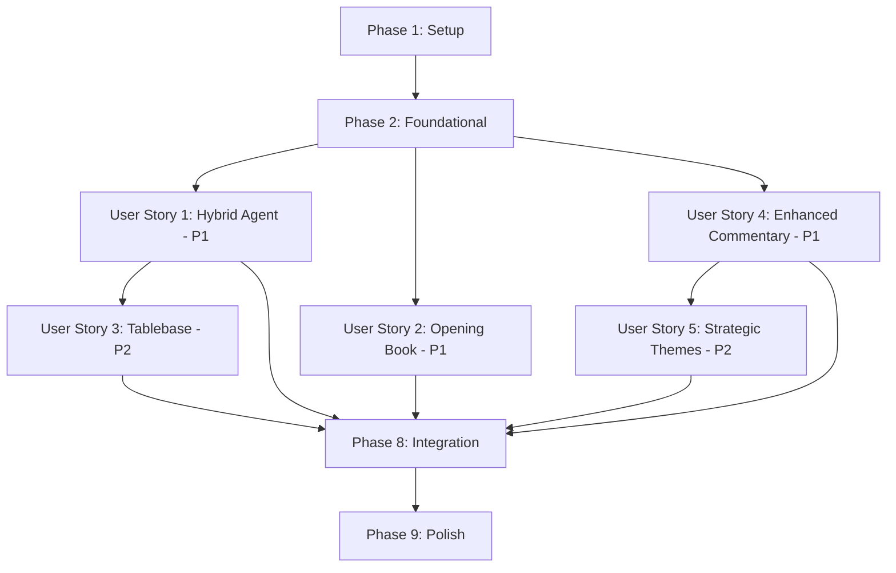

# Implementation Tasks: Phase 1 Quick Wins - Hybrid Agents & Commentary

**Feature**: Phase 1 Quick Wins - Chess Agent & Commentary Improvements  
**Branch**: `001-phase1-quick-wins`  
**Date**: October 25, 2025

## Overview

This document contains implementation tasks organized by user story priority. Each phase represents an independently testable increment of functionality.

**User Stories Priority Order**:
- **P1**: User Story 1 (Hybrid Agent Architecture) - Foundation
- **P1**: User Story 2 (Opening Book Integration) - Fast opening play
- **P1**: User Story 4 (Enhanced Commentary Prompts) - User-facing quality
- **P2**: User Story 3 (Syzygy Tablebase Integration) - Perfect endgames
- **P2**: User Story 5 (Strategic Theme Detection) - Commentary depth

## Phase 1: Setup & Dependencies

**Goal**: Install Stockfish, add HTTP client dependency, verify environment

### Tasks

- [X] T001 Install Stockfish binary on development environment (Ubuntu: `sudo apt-get install stockfish`, macOS: `brew install stockfish`)
- [X] T002 [P] Add requests library to pyproject.toml dependencies (`requests>=2.31.0`)
- [X] T003 [P] Verify Stockfish installation by running `stockfish --help` and checking output
- [X] T004 Create src/utils/api_client.py with base HTTP client configuration (timeout=1.0s, retry logic)

---

## Phase 2: Foundational Components (Blocking Prerequisites)

**Goal**: Enhance Stockfish evaluator to return PV lines - required by ALL user stories

### Tasks

- [X] T005 Enhance StockfishEvaluator.get_top_moves() in src/utils/stockfish_evaluator.py to return List[Tuple[Move, int, List[Move]]] instead of List[Tuple[Move, int]]
- [X] T006 Modify get_top_moves() to use engine.analyse() with multipv parameter instead of separate calls
- [X] T007 Extract PV lines from InfoDict["pv"] list (first move is candidate, rest is continuation)
- [X] T008 Handle PovScore objects correctly: convert to white's perspective, handle both centipawn and mate scores
- [X] T009 Add error handling for empty PV lists and None scores in get_top_moves()
- [X] T010 Update evaluate_move() method to use enhanced get_top_moves() for best alternative analysis
- [X] T011 Add position caching to StockfishEvaluator with game_id scoping (Dict[game_id, Dict[fen, result]])
- [X] T012 Add clear_game_cache(game_id) method to StockfishEvaluator for memory cleanup

---

## Phase 3: User Story 1 - Hybrid Agent Architecture (P1)

**Goal**: Replace LLM-only flow with Stockfish+LLM hybrid selection ensuring tactical soundness

**Independent Test Criteria**:
- Run 10 games with hybrid agents vs baseline LLM-only agents
- Measure blunder rate (moves losing >300cp): target <10% (vs baseline 30%+)
- Verify all moves are from Stockfish top-5 candidates
- Confirm personality differentiation (aggressive vs defensive move selection)
- Test Stockfish unavailable fallback (kill stockfish process mid-game)

### Tasks

- [X] T013 [P] [US1] Create src/models/move_evaluation.py with MoveEvaluation dataclass (move, score, pv_line, quality, best_alternative)
- [X] T014 [P] [US1] Create src/agents/hybrid_agent_selector.py with HybridAgentMoveSelector class
- [X] T015 [US1] Implement _get_hybrid_agent_move() method in HybridAgentMoveSelector using Stockfish top-5 candidates
- [X] T016 [US1] Build enhanced agent prompt in _build_hybrid_agent_prompt() including candidates with scores and PV lines
- [X] T017 [US1] Add get_agent_move_with_candidates() method to ChessAgentManager in src/agents/agent_manager.py
- [X] T018 [US1] Modify agent prompt template to constrain selection to provided candidates
- [X] T019 [US1] Implement candidate validation in _extract_move() to ensure selected move is from candidates
- [X] T020 [US1] Add fallback logic: if agent selects non-candidate, use top candidate from Stockfish
- [X] T021 [US1] Implement pure LLM fallback when Stockfish unavailable in HybridAgentMoveSelector
- [X] T022 [US1] Add structured logging for move source (hybrid/llm-fallback) and candidate selection
- [X] T023 [US1] Update GameOrchestrator.run_game() in src/game_manager/game_orchestrator.py to use HybridAgentMoveSelector
- [X] T024 [US1] Replace direct agent_manager.get_agent_move() calls with hybrid_selector.get_move()
- [X] T025 [US1] Add personality-based candidate emphasis (aggressive→high-risk moves, defensive→safe moves)

**Validation**:
- Run `make test-integration` and verify hybrid agent games complete without errors
- Check logs show "move_source=hybrid" for all moves when Stockfish available
- Verify fallback logging when Stockfish killed: "move_source=llm-fallback"

---

## Phase 4: User Story 2 - Opening Book Integration (P1)

**Goal**: Query Lichess Masters API for opening moves (≤move 15) with personality filtering

**Independent Test Criteria**:
- Start 20 games and verify opening moves match Lichess Masters database
- Measure opening phase timing: target <0.5s per move (vs 2-5s LLM)
- Verify aggressive personalities select sharp lines (Sicilian, King's Indian)
- Verify defensive personalities select solid lines (Caro-Kann, French)
- Test API unavailable fallback (block lichess.org in hosts file)

### Tasks

- [X] T026 [P] [US2] Create src/utils/opening_book_client.py with OpeningBookClient class
- [X] T027 [P] [US2] Implement query_opening_book() function calling Lichess Masters API (https://explorer.lichess.org/masters)
- [X] T028 [US2] Parse API response JSON extracting moves list with uci, san, white, draws, black, averageRating fields
- [X] T029 [US2] Implement select_opening_move() with personality-based filtering logic
- [X] T030 [US2] Add aggressive personality filter: sort by draw_rate (high = sharp), select from top 3
- [X] T031 [US2] Add defensive personality filter: sort by draw_rate (low = solid), select from top 3
- [X] T032 [US2] Add balanced/tactical/positional filter: sort by play_frequency, select from top 3
- [X] T033 [US2] Implement position caching in OpeningBookClient (Dict[fen, api_response])
- [X] T034 [US2] Add should_use_opening_book(move_number) helper returning True if move_number <= 15
- [X] T035 [US2] Add timeout handling (1.0s) and graceful None return on API failure
- [X] T036 [US2] Integrate OpeningBookClient into HybridAgentMoveSelector.get_move() as priority #2 (after tablebase)
- [X] T037 [US2] Add logging for opening book hits: "move_source=opening_book, move={uci}"
- [X] T038 [US2] Add logging for opening book misses and API failures

**Validation**:
- Start game and verify first 10 moves match Lichess Masters recommendations
- Check logs show "move_source=opening_book" for opening phase
- Block API and verify fallback to hybrid agent: "opening_book_unavailable"

---

## Phase 5: User Story 4 - Enhanced Commentary Prompts (P1)

**Goal**: Build comprehensive prompts with Stockfish analysis, best alternatives, PV lines, and move quality

**Independent Test Criteria**:
- Generate commentary for 20 sample positions (5 blunders, 5 brilliant, 10 normal)
- Verify 100% include best alternative move with continuation when move isn't best
- Verify commentary references specific squares (e.g., "weakens d5", "knight on c6")
- Measure prompt token count: target 800-1200 tokens (detailed but not excessive)
- Human evaluation: 8/10 commentaries should be rated "informative" vs current "generic"

### Tasks

- [ ] T039 [P] [US4] Create src/commentary/commentary_prompt_builder.py with CommentaryPromptBuilder class
- [ ] T040 [P] [US4] Add __init__ accepting StockfishEvaluator and StrategicThemeAnalyzer dependencies
- [ ] T041 [US4] Implement build_prompt() method accepting board_before, move, board_after, trigger_type parameters
- [ ] T042 [US4] Add _format_eval() helper converting centipawn scores to human-readable strings (+150cp = White advantage)
- [ ] T043 [US4] Add _format_pv_line() helper converting List[Move] to UCI string sequence
- [ ] T044 [US4] Query Stockfish for eval_before, eval_after, top 3 candidates with PV lines in build_prompt()
- [ ] T045 [US4] Evaluate played move quality using StockfishEvaluator.evaluate_move()
- [ ] T046 [US4] Build prompt section: Position Before Move (FEN, evaluation)
- [ ] T047 [US4] Build prompt section: Move Played (UCI, SAN, quality, centipawn loss, PV continuation)
- [ ] T048 [US4] Build prompt section: Best Alternative (if move not best: show top move, score, PV line)
- [ ] T049 [US4] Add prompt length requirements: 4-6 sentences for blunder/brilliant/checkmate, 2-3 for standard
- [ ] T050 [US4] Add commentary style instructions: explain WHY move is good/bad, reference specific squares/pieces
- [ ] T051 [US4] Handle mate scores in prompts: convert to "Mate in N" instead of centipawn values
- [ ] T052 [US4] Integrate CommentaryPromptBuilder into CommentaryGenerator in src/commentary/commentary_generator.py
- [ ] T053 [US4] Replace current simple prompts with CommentaryPromptBuilder.build_prompt() calls
- [ ] T054 [US4] Update _generate_commentary_internal() to use enhanced prompts for all trigger types

**Validation**:
- Generate commentary for Scholar's Mate position and verify includes "Qf7 delivers checkmate" with explanation
- Generate commentary for blunder and verify explains what advantage was lost with specific eval drop
- Check prompt includes "Best Alternative:" section when move isn't optimal

---

## Phase 6: User Story 3 - Syzygy Tablebase Integration (P2)

**Goal**: Query Lichess Tablebase API for perfect endgame play (≤7 pieces)

**Independent Test Criteria**:
- Create 10 endgame positions (5 wins, 3 draws, 2 losses from tablebase perspective)
- Verify 100% of winning positions are converted to wins with optimal moves
- Verify draw positions select drawing moves (not losing moves)
- Measure endgame timing: target <0.5s per move (instant tablebase lookup)
- Test API unavailable fallback (block tablebase.lichess.ovh)

### Tasks

- [ ] T055 [P] [US3] Create src/utils/tablebase_client.py with TablebaseClient class
- [ ] T056 [P] [US3] Implement query_tablebase() function calling Lichess Tablebase API (https://tablebase.lichess.ovh/standard)
- [ ] T057 [US3] Parse API response JSON extracting dtz, category (win/draw/loss), moves list
- [ ] T058 [US3] Implement get_tablebase_move() extracting optimal move: prefer wins (min dtz), then draws, reject losses
- [ ] T059 [US3] Add piece counting helper _count_pieces(fen) returning total piece count from FEN string
- [ ] T060 [US3] Implement per-game-session caching: Dict[game_id, Dict[fen, response]]
- [ ] T061 [US3] Add get_move(fen, game_id) method checking piece count, querying API, returning optimal move or None
- [ ] T062 [US3] Add clear_game_cache(game_id) method for memory cleanup when game ends
- [ ] T063 [US3] Add timeout handling (1.0s) and graceful None return on API failure
- [ ] T064 [US3] Integrate TablebaseClient into HybridAgentMoveSelector.get_move() as priority #1 (before opening book)
- [ ] T065 [US3] Add logging for tablebase hits: "move_source=tablebase, move={uci}, category={win/draw}"
- [ ] T066 [US3] Add logging for tablebase misses (>7 pieces) and API failures
- [ ] T067 [US3] Update GameOrchestrator to call tablebase.clear_game_cache() on game completion

**Validation**:
- Load K+Q vs K endgame and verify agent delivers checkmate in optimal moves
- Check logs show "move_source=tablebase, category=win" for winning endgames
- Load K+R vs K+P (7 pieces) and verify tablebase queried: piece count logged

---

## Phase 7: User Story 5 - Strategic Theme Detection (P2)

**Goal**: Detect positional patterns (isolated pawns, bad bishops, rooks on 7th, space, king safety)

**Independent Test Criteria**:
- Analyze 15 positions with known themes (3 per theme type)
- Verify isolated pawn detection: position with d5 isolated pawn correctly identified with square
- Verify bad bishop detection: bishop on c1 with pawns on d2,e3,f2 identified as "bad light-squared bishop"
- Verify rook on 7th detection: rook on d7 correctly identified
- Verify space advantage: count central square control and report advantage when diff ≥3
- Verify king safety: weak pawn shield (<2 pawns) detected

### Tasks

- [ ] T068 [P] [US5] Create src/analysis/strategic_theme_analyzer.py with StrategicThemeAnalyzer class
- [ ] T069 [P] [US5] Create src/models/strategic_theme.py with StrategicTheme dataclass (theme_type, description, severity, square, piece)
- [ ] T070 [US5] Implement analyze(board) method returning List[StrategicTheme] with all detected themes
- [ ] T071 [US5] Implement _detect_isolated_pawns() checking each pawn for friendly pawns on adjacent files
- [ ] T072 [US5] Implement _detect_bad_bishops() counting same-color-square pawns (≥3 = bad bishop)
- [ ] T073 [US5] Implement _detect_rooks_on_7th() checking white rooks on rank 7, black rooks on rank 2
- [ ] T074 [US5] Implement _detect_space_advantage() counting attackers on d4, d5, e4, e5 (diff ≥3 = advantage)
- [ ] T075 [US5] Implement _detect_king_safety() checking pawn shield count (<2 = weak) and back rank traps
- [ ] T076 [US5] Add severity scoring (0.0-1.0): back_rank_weakness=0.9, bad_bishop=0.7, isolated_pawn=0.6, etc.
- [ ] T077 [US5] Integrate StrategicThemeAnalyzer into CommentaryPromptBuilder
- [ ] T078 [US5] Add Strategic Themes section to commentary prompts when themes detected
- [ ] T079 [US5] Format theme descriptions for commentary: "- {description}" per theme
- [ ] T080 [US5] Handle empty theme list gracefully (skip section if no themes detected)

**Validation**:
- Analyze position "r1bqkb1r/pp2pppp/2n2n2/3p4/3P4/2N2N2/PP2PPPP/R1BQKB1R" and verify detects isolated d-pawn
- Analyze position with bishop on c1, pawns d2/e3/f2 and verify "bad light-squared bishop" detected
- Check commentary prompt includes "=== STRATEGIC THEMES ===" section with detected themes

---

## Phase 8: Integration & Testing

**Goal**: Wire all components together, add end-to-end tests, verify success criteria

### Tasks

- [ ] T081 [P] Create tests/integration/test_hybrid_agent.py with test cases for User Story 1
- [ ] T082 [P] Create tests/integration/test_opening_book.py with test cases for User Story 2
- [ ] T083 [P] Create tests/integration/test_tablebase.py with test cases for User Story 3
- [ ] T084 [P] Create tests/integration/test_enhanced_commentary.py with test cases for User Story 4
- [ ] T085 [P] Create tests/integration/test_strategic_themes.py with test cases for User Story 5
- [ ] T086 Add test_hybrid_agent_selects_from_top5() verifying move is always from Stockfish candidates
- [ ] T087 Add test_aggressive_personality_prefers_sharp_moves() comparing aggressive vs defensive selections
- [ ] T088 Add test_opening_book_matches_masters_database() for first 15 moves
- [ ] T089 Add test_tablebase_converts_winning_endgames() with K+Q vs K position
- [ ] T090 Add test_commentary_includes_best_alternative() for mistake/blunder triggers
- [ ] T091 Add test_strategic_themes_detected_correctly() for all 5 theme types
- [ ] T092 Add test_fallback_stockfish_unavailable() killing Stockfish process mid-game
- [ ] T093 Add test_fallback_opening_book_unavailable() mocking API timeout
- [ ] T094 Add test_fallback_tablebase_unavailable() mocking API failure
- [ ] T095 Create tests/performance/test_move_timing.py measuring latency targets
- [ ] T096 Add test_opening_book_latency() verifying <0.5s per move (SC-006)
- [ ] T097 Add test_hybrid_agent_latency() verifying <5s per move (Stockfish + LLM)
- [ ] T098 Add test_tablebase_latency() verifying <0.5s per move
- [ ] T099 Run 100-game test suite measuring blunder rate, centipawn loss, tactical accuracy (SC-001, SC-002, SC-003)
- [ ] T100 Generate baseline metrics report comparing hybrid vs LLM-only agents

---

## Phase 9: Polish & Documentation

**Goal**: Add configuration, update README, document API changes, add monitoring

### Tasks

- [ ] T101 [P] Add Stockfish configuration to config/default_agent_config.yaml (depth: 15, multipv: 5, cache_enabled: true)
- [ ] T102 [P] Add opening book configuration (api_url, timeout, cache_size, cutoff_move: 15)
- [ ] T103 [P] Add tablebase configuration (api_url, timeout, max_pieces: 7, cache_per_game: true)
- [ ] T104 [P] Update README.md with new features section: Hybrid Agent Architecture, Opening Book, Tablebase
- [ ] T105 [P] Add setup instructions for Stockfish installation to README.md
- [ ] T106 [P] Document API rate limiting considerations for Lichess APIs
- [ ] T107 Create docs/hybrid-agent-architecture.md explaining Stockfish integration and move selection flow
- [ ] T108 Create docs/commentary-enhancement.md explaining prompt structure and theme detection
- [ ] T109 Add Prometheus metrics for move source tracking (counter per source: tablebase/book/hybrid/llm-fallback)
- [ ] T110 Add Prometheus metrics for API latency (histogram per API: stockfish/opening_book/tablebase)
- [ ] T111 Add Prometheus metrics for blunder rate (gauge updated per game)
- [ ] T112 Update OpenAPI spec in src/api/routes.py documenting enhanced move evaluation responses
- [ ] T113 Add /api/agent/stats endpoint returning move source breakdown and performance metrics
- [ ] T114 Update Docker configuration to include Stockfish binary in container image
- [ ] T115 Add healthcheck for Stockfish availability in src/api/routes.py (/health endpoint)

---

## Dependencies & Execution Order

### Story Completion Order

**Story Dependencies**:
- **US1 (Hybrid Agent)**: No dependencies on other stories - can start after Phase 2
- **US2 (Opening Book)**: No dependencies on other stories - can start after Phase 2
- **US3 (Tablebase)**: Requires US1 (integrated into HybridAgentMoveSelector)
- **US4 (Enhanced Commentary)**: No dependencies on other stories - can start after Phase 2
- **US5 (Strategic Themes)**: Requires US4 (themes used in commentary prompts)

**Parallel Opportunities**:
- US1, US2, US4 can be developed in parallel (all P1, independent)
- US3 and US5 can be developed in parallel (both P2, different domains)
- All test tasks (T081-T094) can be written in parallel
- All polish tasks (T101-T115) can be executed in parallel

### Suggested MVP Scope

**Minimum Viable Product**: User Story 1 only (Hybrid Agent Architecture)

**Rationale**:
- US1 addresses the core problem (frequent blunders)
- US1 provides immediate value (playable, competitive games)
- US1 is foundation for US3 (tablebase integration)
- US2, US4, US5 are enhancements on top of US1

**MVP Task Subset**: T001-T004 (Setup), T005-T012 (Foundational), T013-T025 (US1), T086-T087 (US1 Tests)

---

## Task Summary

**Total Tasks**: 115
- Phase 1 (Setup): 4 tasks
- Phase 2 (Foundational): 8 tasks
- Phase 3 (US1 - Hybrid Agent): 13 tasks
- Phase 4 (US2 - Opening Book): 13 tasks
- Phase 5 (US4 - Enhanced Commentary): 16 tasks
- Phase 6 (US3 - Tablebase): 13 tasks
- Phase 7 (US5 - Strategic Themes): 13 tasks
- Phase 8 (Integration & Testing): 20 tasks
- Phase 9 (Polish): 15 tasks

**Parallelization Opportunities**: 68 tasks marked [P] (59% of total)

**Independent Test Criteria Defined**: All 5 user stories

**Format Validation**: ✅ All tasks follow checklist format (checkbox, ID, labels, file paths)

---

## Implementation Strategy

### Incremental Delivery Plan

1. **Week 1**: Complete MVP (US1 only) - 25 tasks
   - Deliver: Hybrid agents with Stockfish candidate selection
   - Value: Eliminate blunders, improve game quality

2. **Week 2**: Add US2 (Opening Book) and US4 (Enhanced Commentary) - 29 tasks
   - Deliver: Fast opening play + grandmaster-level analysis commentary
   - Value: Faster games + educational content

3. **Week 3**: Add US3 (Tablebase) and US5 (Strategic Themes) - 26 tasks
   - Deliver: Perfect endgames + deep positional analysis
   - Value: Complete competitive gameplay + rich commentary

4. **Week 4**: Integration testing and polish - 35 tasks
   - Deliver: Production-ready feature with monitoring
   - Value: Reliable, observable system

### Risk Mitigation

**Risk**: Stockfish binary distribution complexity  
**Mitigation**: Document installation in README (T105), add Docker bundling (T114), add healthcheck (T115)

**Risk**: Lichess API rate limiting  
**Mitigation**: Implement caching (T033, T060), add timeout handling (T035, T063), document limits (T106)

**Risk**: LLM agent doesn't respect candidate constraints  
**Mitigation**: Add validation (T019), implement fallback (T020), log violations for monitoring

**Risk**: Commentary prompts too long (token limits)  
**Mitigation**: Limit PV lines to 5 moves (T043), conditional sections (themes only if detected), measure token count (test criteria US4)

---

**Generated**: October 25, 2025  
**Ready for Execution**: ✅  
**Next Step**: Begin Phase 1 (Setup) with T001-T004
